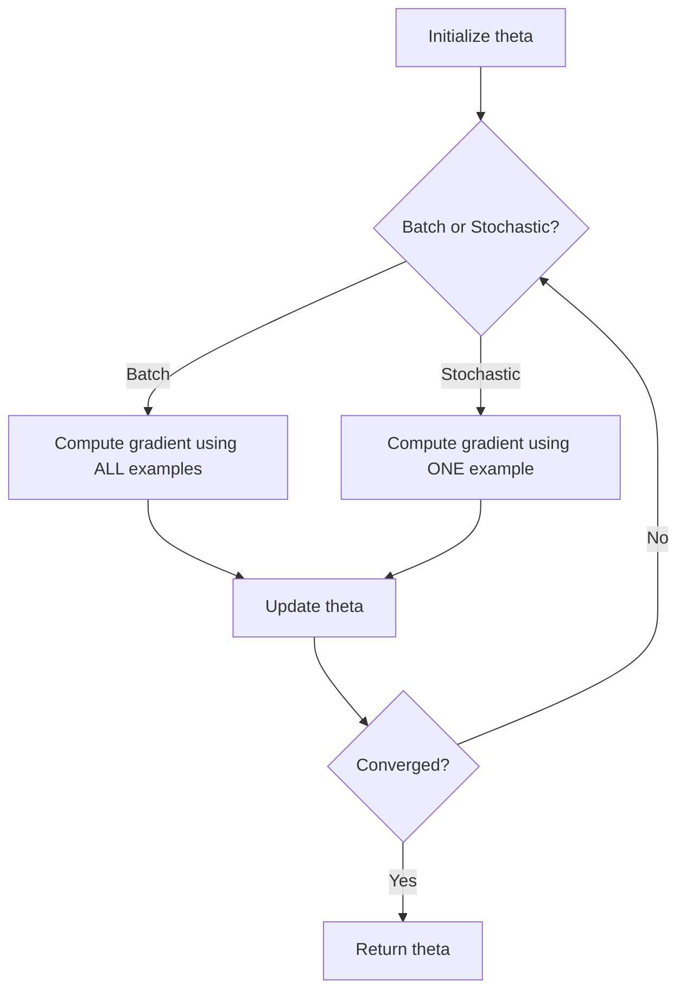

# CS229 — Linear Regression

## 1. Setup and Hypothesis

### 1.1 Problem Setup
We want to predict a target $y$ (e.g., house price) from input features $x$ (e.g., living area, number of bedrooms). Each training example $x^{(i)}$ can be a vector — for instance, $x_1^{(i)}$ = living area of house $i$, $x_2^{(i)}$ = number of bedrooms of house $i$. Choosing which features to use is part of designing the learning problem.

### 1.2 Hypothesis Function
We approximate $y$ as a linear function of $x$:

$$
h_\theta(x) = \theta_0 + \theta_1 x_1 + \theta_2 x_2
$$

- $\theta_i$ → **parameters** (also called **weights**) of the model.
- By convention we set $x_0 = 1$ (the **intercept term**), so the hypothesis becomes:

$$
h(x) = \sum_{i=0}^{d} \theta_i x_i = \theta^T x
$$

where $d$ is the number of input features (not counting $x_0$), and $\theta$, $x$ are viewed as vectors.

### 1.3 Cost Function
To learn $\theta$, we need a way to measure how close $h(x)$ is to $y$ on the training set. We define the **cost function**:

$$
J(\theta) = \frac{1}{2}\sum_{i=1}^{n}\left(h_\theta(x^{(i)}) - y^{(i)}\right)^2
$$

This is the familiar **least-squares cost function**. The goal of learning is to find $\theta$ that minimizes $J(\theta)$.

---

## 2. LMS Algorithm (Gradient Descent)

### 2.1 Intuition
> 💡 **Intuition:** Start with a guess for $\theta$, and repeatedly nudge it in the direction that most reduces the cost $J(\theta)$, until we converge to a minimum.

### 2.2 Gradient Descent Update Rule

$$
\theta_j := \theta_j - \alpha \frac{\partial}{\partial \theta_j} J(\theta)
$$

- $\alpha$ → **learning rate** (step size).
- Update is performed **simultaneously** for all $j = 0, \dots, d$.

### 2.3 Deriving the Update (Single Training Example)
For one training example $(x, y)$:

$$
\frac{\partial}{\partial \theta_j} J(\theta) = (h_\theta(x) - y)\, x_j
$$

This gives the **LMS update rule** (Least Mean Squares, also known as the **Widrow-Hoff rule**):

$$
\theta_j := \theta_j + \alpha \left(y^{(i)} - h_\theta(x^{(i)})\right) x_j^{(i)}
$$

> ⚠️ **Important:** The size of the update is proportional to the error $(y^{(i)} - h_\theta(x^{(i)}))$. Small error → small update. Large error → large update. This is an intuitive and natural property.

### 2.4 Batch Gradient Descent
Extending the rule to the full training set (all $n$ examples), updating $\theta$ using **every** example at each step:

$$
\theta_j := \theta_j + \alpha \sum_{i=1}^{n} \left(y^{(i)} - h_\theta(x^{(i)})\right) x_j^{(i)} \quad \text{(for every } j\text{)}
$$

- This is exactly **gradient descent** on $J(\theta)$, since the summation term equals $\partial J(\theta)/\partial \theta_j$.
- Called **batch gradient descent** because it looks at the entire training set on every step.
- The linear regression cost function $J$ is a **convex quadratic function** with only **one global optimum** (no local minima). So gradient descent always converges to the global minimum, provided $\alpha$ is not too large.

**Example result:** Fitting on housing price vs. living area gives $\theta_0 = 71.27$, $\theta_1 = 0.1345$. Adding number of bedrooms as a feature gives $\theta_0 = 89.60$, $\theta_1 = 0.1392$, $\theta_2 = -8.738$.

### 2.5 Stochastic Gradient Descent
Instead of scanning the whole dataset before each update, update $\theta$ after looking at **one example at a time**:

$$
\theta := \theta + \alpha \left(y^{(i)} - h_\theta(x^{(i)})\right) x^{(i)}
$$

**Algorithm:**
1. Loop over the training set.
2. For each example $i$, update all $\theta_j$ using only that example's gradient.
3. Repeat.

> ⚠️ **Important:** Stochastic gradient descent (SGD) usually reaches "close" to the minimum much faster than batch gradient descent, especially for large $n$, because it doesn't wait to scan the whole dataset before making progress. However, it may **never fully converge** — $\theta$ tends to oscillate around the minimum. Slowly decreasing $\alpha$ toward zero can help it converge properly.

| Method | Examples used per update | Speed per step | Convergence |
|---|---|---|---|
| Batch Gradient Descent | All $n$ examples | Slow (costly if $n$ large) | Converges exactly to minimum |
| Stochastic Gradient Descent | 1 example | Fast, immediate progress | Oscillates near minimum |



---

## 3. The Normal Equations

An alternative to the iterative gradient descent: minimize $J(\theta)$ **directly in closed form** by taking derivatives and setting them to zero.

### 3.1 Matrix Derivative Notation
For a function $f: \mathbb{R}^{n \times d} \to \mathbb{R}$ mapping matrices to real numbers, the derivative with respect to matrix $A$ is itself a matrix of the same shape, whose $(i,j)$ entry is $\partial f / \partial A_{ij}$:

$$
\nabla_A f(A) = \begin{bmatrix} \frac{\partial f}{\partial A_{11}} & \cdots & \frac{\partial f}{\partial A_{1d}} \\ \vdots & \ddots & \vdots \\ \frac{\partial f}{\partial A_{n1}} & \cdots & \frac{\partial f}{\partial A_{nd}} \end{bmatrix}
$$

### 3.2 Setting Up in Matrix Form
Define the **design matrix** $X$ (n-by-(d+1), rows are training examples' inputs, including the intercept term):

$$
X = \begin{bmatrix} -(x^{(1)})^T- \\ -(x^{(2)})^T- \\ \vdots \\ -(x^{(n)})^T- \end{bmatrix}, \qquad
y = \begin{bmatrix} y^{(1)} \\ y^{(2)} \\ \vdots \\ y^{(n)} \end{bmatrix}
$$

Since $h_\theta(x^{(i)}) = (x^{(i)})^T\theta$, we get:

$$
X\theta - y = \begin{bmatrix} h_\theta(x^{(1)}) - y^{(1)} \\ \vdots \\ h_\theta(x^{(n)}) - y^{(n)} \end{bmatrix}
$$

Using $z^Tz = \sum_i z_i^2$, the cost function becomes:

$$
J(\theta) = \frac{1}{2}(X\theta - y)^T(X\theta - y)
$$

### 3.3 Deriving the Normal Equations
Taking the gradient with respect to $\theta$ (using $\nabla_x b^Tx = b$ and $\nabla_x x^TAx = 2Ax$ for symmetric $A$):

$$
\nabla_\theta J(\theta) = X^TX\theta - X^Ty
$$

Setting this to zero gives the **normal equations**:

$$
X^TX\theta = X^Ty
$$

Solving for $\theta$:

$$
\theta = (X^TX)^{-1}X^Ty
$$

> ⚠️ **Important:** This closed-form solution assumes $X^TX$ is invertible. It is not invertible if there are fewer linearly independent examples than features, or if features are not linearly independent.

---

## 4. Probabilistic Interpretation

### 4.1 Why Least Squares?
> 💡 **Intuition:** Least squares isn't an arbitrary choice — it naturally arises from a simple probabilistic assumption about how the data is generated.

Assume the target and inputs are related by:

$$
y^{(i)} = \theta^Tx^{(i)} + \epsilon^{(i)}
$$

- $\epsilon^{(i)}$ → error term capturing unmodeled effects or random noise.
- Assume $\epsilon^{(i)}$ are **IID** (independently and identically distributed) as $\epsilon^{(i)} \sim \mathcal{N}(0, \sigma^2)$ (Gaussian with mean 0, variance $\sigma^2$).

This implies:

$$
y^{(i)} \mid x^{(i)}; \theta \sim \mathcal{N}(\theta^Tx^{(i)}, \sigma^2)
$$

### 4.2 Likelihood and Maximum Likelihood Estimation
Given the design matrix $X$ and parameters $\theta$, the **likelihood function** is:

$$
L(\theta) = \prod_{i=1}^{n} \frac{1}{\sqrt{2\pi}\sigma}\exp\left(-\frac{(y^{(i)} - \theta^Tx^{(i)})^2}{2\sigma^2}\right)
$$

**Maximum Likelihood Estimation (MLE)** says we should choose $\theta$ to maximize $L(\theta)$ — i.e., make the observed data as probable as possible.

It's easier to maximize the **log-likelihood** $\ell(\theta) = \log L(\theta)$ instead (log is strictly increasing, so it gives the same maximizer):

$$
\ell(\theta) = n\log\frac{1}{\sqrt{2\pi}\sigma} - \frac{1}{\sigma^2}\cdot\frac{1}{2}\sum_{i=1}^{n}\left(y^{(i)} - \theta^Tx^{(i)}\right)^2
$$

Maximizing $\ell(\theta)$ is equivalent to **minimizing**:

$$
\frac{1}{2}\sum_{i=1}^{n}\left(y^{(i)} - \theta^Tx^{(i)}\right)^2 = J(\theta)
$$

**Conclusion:** Under the Gaussian-noise assumption, least-squares regression = maximum likelihood estimation of $\theta$.

> ⚠️ **Important:** The optimal $\theta$ does not depend on the value of $\sigma^2$ — it would be the same even if $\sigma^2$ were unknown. This fact resurfaces later with the exponential family and Generalized Linear Models.

```text
Linear Regression (least squares)
       ↓
   justified by
       ↓
Gaussian noise assumption + Maximum Likelihood Estimation
       ↓
   generalizes to
       ↓
Exponential Family → Generalized Linear Models → Logistic Regression
```

---

## 5. Locally Weighted Linear Regression (LWR)

### 5.1 Motivation: Underfitting vs. Overfitting
- Fitting $y = \theta_0 + \theta_1 x$ to non-linear data → poor fit (**underfitting**): the model misses real structure in the data.
- Adding a feature $x^2$ (i.e., $y = \theta_0 + \theta_1 x + \theta_2 x^2$) → better fit.
- Fitting a high-degree polynomial (e.g., degree 5) → fits training data perfectly but generalizes poorly (**overfitting**).

| Problem | Description | Cause |
|---|---|---|
| Underfitting | Model misses structure clearly present in the data | Model too simple |
| Overfitting | Model fits training data perfectly but won't generalize | Model too complex / too many features |

### 5.2 What is LWR?
LWR is a technique that makes the choice of features **less critical**, provided there is enough training data. It is the first **non-parametric** algorithm introduced.

| Type | Definition | Example |
|---|---|---|
| Parametric | Fixed, finite number of parameters fit to data; training data can be discarded after fitting | Ordinary linear regression |
| Non-parametric | Amount of information needed to represent the hypothesis grows with the size of the training set; must keep all training data | Locally weighted linear regression |

### 5.3 Algorithm
**Ordinary linear regression**, to predict at query point $x$:
1. Fit $\theta$ to minimize $\sum_i (y^{(i)} - \theta^Tx^{(i)})^2$.
2. Output $\theta^Tx$.

**Locally weighted linear regression**, to predict at query point $x$:
1. Fit $\theta$ to minimize $\sum_i w^{(i)}(y^{(i)} - \theta^Tx^{(i)})^2$.
2. Output $\theta^Tx$.

### 5.4 Weights
A standard choice of weight for example $i$, relative to query point $x$:

$$
w^{(i)} = \exp\left(-\frac{(x^{(i)} - x)^2}{2\tau^2}\right)
$$

- If $x^{(i)}$ is **close** to $x$ → $w^{(i)} \approx 1$ (this example strongly influences the fit).
- If $x^{(i)}$ is **far** from $x$ → $w^{(i)} \approx 0$ (this example is nearly ignored).
- $\tau$ → **bandwidth parameter**, controls how quickly the weight falls off with distance from the query point.

> ⚠️ **Important:** Although the weight formula looks like a Gaussian density, $w^{(i)}$ is **not** a probability and has no direct connection to Gaussian distributions — it's just a convenient decaying function of distance.

For vector-valued $x$, this generalizes to:

$$
w^{(i)} = \exp\left(-\frac{(x^{(i)}-x)^T(x^{(i)}-x)}{2\tau^2}\right)
$$

or, using a covariance-like matrix $\Sigma$:

$$
w^{(i)} = \exp\left(-\frac{(x^{(i)}-x)^T\Sigma^{-1}(x^{(i)}-x)}{2\tau^2}\right)
$$

---

## Key Takeaways

- **Hypothesis:** $h_\theta(x) = \theta^Tx$, with $x_0 = 1$ as the intercept trick.
- **Cost function:** $J(\theta) = \frac{1}{2}\sum_i (h_\theta(x^{(i)}) - y^{(i)})^2$ — the least-squares objective.
- **Gradient Descent (LMS):** iteratively update $\theta_j := \theta_j + \alpha(y^{(i)} - h_\theta(x^{(i)}))x_j^{(i)}$.
  - **Batch GD:** uses all examples per update; guaranteed convergence to global minimum (J is convex quadratic, no local minima) but slow for large $n$.
  - **Stochastic GD:** uses one example per update; faster progress, but oscillates near the minimum instead of converging exactly (unless $\alpha \to 0$).
- **Normal Equations:** closed-form solution $\theta = (X^TX)^{-1}X^Ty$, avoids iteration but requires $X^TX$ to be invertible.
- **Probabilistic view:** Assuming Gaussian IID noise $\epsilon^{(i)} \sim \mathcal{N}(0,\sigma^2)$, minimizing least-squares cost $J(\theta)$ is equivalent to Maximum Likelihood Estimation of $\theta$. The result doesn't depend on $\sigma^2$.
- **Locally Weighted Linear Regression:** a non-parametric method that re-fits a local linear model for every query point, weighting nearby training examples more heavily (controlled by bandwidth $\tau$). Reduces sensitivity to feature choice, at the cost of keeping the entire training set around.
- **Underfitting vs. overfitting:** too simple a model misses real structure; too complex a model fits noise and generalizes poorly. Feature choice and model complexity must balance the two.
