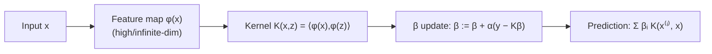

# CS229 — Kernel Methods

## 1. Feature Maps

### 1.1 Concept
A **feature map** $\phi$ transforms the original input (called **input attributes**, e.g. living area $x$) into a new set of variables called **features** ($\phi(x)$). This lets us fit non-linear functions of $x$ using the same linear-model machinery.

### 1.2 Intuition
💡 **Intuition:** A cubic function $\theta_3x^3+\theta_2x^2+\theta_1x+\theta_0$ is *non-linear in $x$*, but it is *linear in the vector* $\phi(x)=[1,\,x,\,x^2,\,x^3]^T$. So instead of inventing new algorithms for non-linear models, we just change the inputs fed to the linear algorithm.

### 1.3 Mathematical Formulation
$$
\phi(x) = \begin{bmatrix}1\\x\\x^2\\x^3\end{bmatrix}\in\mathbb{R}^4,\qquad \theta^T\phi(x)=\theta_3x^3+\theta_2x^2+\theta_1x+\theta_0
$$
- $x$ → input attribute (original variable)
- $\phi(x)$ → feature vector (transformed variable)
- $\theta$ → parameter vector, now over the feature space, not the raw input space

---

## 2. LMS (Least Mean Squares) with Features

### 2.1 Concept
We refit the least-squares update rule so it operates on $\phi(x)$ instead of $x$.

### 2.2 Mathematical Formulation
Ordinary least squares batch update (fitting $\theta^Tx$):
$$
\theta := \theta + \alpha\sum_{i=1}^n\left(y^{(i)}-\theta^Tx^{(i)}\right)x^{(i)}
$$
Replacing $x^{(i)}$ with $\phi(x^{(i)})$, where $\phi:\mathbb{R}^d\to\mathbb{R}^p$:
$$
\theta := \theta + \alpha\sum_{i=1}^n\left(y^{(i)}-\theta^T\phi(x^{(i)})\right)\phi(x^{(i)})
$$
Stochastic version:
$$
\theta := \theta + \alpha\left(y^{(i)}-\theta^T\phi(x^{(i)})\right)\phi(x^{(i)})
$$

> ⚠️ **Important:** This works fine mathematically, but becomes computationally expensive when $\phi(x)$ is very high-dimensional — this is exactly the problem the kernel trick solves.

---

## 3. LMS with the Kernel Trick

### 3.1 The Problem: Curse of Dimensionality in Feature Space
If $\phi(x)$ contains **all monomials of $x$ up to degree 3** for $x\in\mathbb{R}^d$, then $\dim(\phi(x)) \sim O(d^3)$.

**Example:** for $d=1000$, each update needs to compute/store a $10^9$-dimensional vector — about $10^6\times$ slower than plain least squares.

### 3.2 Key Idea
💡 **Intuition:** $\theta$ never needs to be stored explicitly. At every step, $\theta$ is just a **linear combination** of the training feature vectors $\phi(x^{(1)}),\dots,\phi(x^{(n)})$. So instead of tracking a huge vector $\theta\in\mathbb{R}^p$, we track $n$ scalar coefficients $\beta_1,\dots,\beta_n$.

### 3.3 Derivation

**Step 1 — Show $\theta$ stays a linear combination of feature vectors.**
Initialize $\theta = 0 = \sum_i 0\cdot\phi(x^{(i)})$. Suppose at some point:
$$
\theta = \sum_{i=1}^n \beta_i\phi(x^{(i)})
$$
Applying one LMS update:
$$
\theta := \sum_{i=1}^n \underbrace{\left(\beta_i + \alpha\left(y^{(i)}-\theta^T\phi(x^{(i)})\right)\right)}_{\text{new }\beta_i}\phi(x^{(i)})
$$
So $\theta$ remains expressible this way — only the $\beta_i$ change.

**Step 2 — Rewrite the update purely in terms of $\beta$.**
Substituting $\theta = \sum_j\beta_j\phi(x^{(j)})$ into the $\beta_i$ update:
$$
\beta_i := \beta_i + \alpha\left(y^{(i)} - \sum_{j=1}^n\beta_j\,\phi(x^{(j)})^T\phi(x^{(i)})\right)
$$
The term $\phi(x^{(j)})^T\phi(x^{(i)})$ is written $\langle\phi(x^{(j)}),\phi(x^{(i)})\rangle$ — the **inner product** of two feature vectors.

**Step 3 — Define the kernel.**
$$
K(x,z) \triangleq \langle\phi(x),\phi(z)\rangle
$$
Two things make this efficient:
1. All pairwise values $K(x^{(i)},x^{(j)})$ can be **pre-computed once** before training starts.
2. For many useful $\phi$, $K(x,z)$ can be computed **without ever forming $\phi(x)$ explicitly.**

**Example (degree-3 monomial feature map):**
$$
\langle\phi(x),\phi(z)\rangle = 1+\langle x,z\rangle+\langle x,z\rangle^2+\langle x,z\rangle^3
$$
This only needs $\langle x,z\rangle$ (an $O(d)$ computation), then a constant number of extra operations — instead of forming a $O(d^3)$-dimensional vector.

### 3.4 Final Algorithm
1. Compute $K(x^{(i)}, x^{(j)}) = \langle\phi(x^{(i)}),\phi(x^{(j)})\rangle$ for all pairs $i,j$. Initialize $\beta := 0$.
2. Loop:
$$
\beta_i := \beta_i + \alpha\left(y^{(i)} - \sum_{j=1}^n \beta_j K(x^{(i)}, x^{(j)})\right)\quad \forall i
$$
   In matrix form, with $K_{ij}=K(x^{(i)},x^{(j)})$:
$$
\beta := \beta + \alpha(y - K\beta)
$$
   → Each update now costs $O(n)$, regardless of the feature space's dimension $p$.
3. **Prediction** for a new input $x$ (never needs $\theta$ directly):
$$
\theta^T\phi(x) = \sum_{i=1}^n \beta_i\, K(x^{(i)}, x)
$$



> ⚠️ **Important:** The whole point of the kernel trick — we never need to compute or store $\phi(x)$. We only need $K(x,z)$, and sometimes $K$ can be computed even when $\phi$ is **infinite-dimensional** (see Gaussian kernel below).

---

## 4. Properties of Kernels

### 4.1 The Central Question
Given some function $K(x,z)$, can we tell — *without* knowing $\phi$ — whether a feature map $\phi$ exists such that $K(x,z)=\phi(x)^T\phi(z)$? If yes, we can pick kernels directly and skip designing $\phi$ altogether.

### 4.2 Examples of Kernels

| Kernel | Formula | Feature space |
|---|---|---|
| Quadratic | $K(x,z)=(x^Tz)^2$ | all pairwise products $x_ix_j$ |
| Quadratic + bias | $K(x,z)=(x^Tz+c)^2$ | pairwise products + scaled linear terms + constant |
| Degree-$k$ polynomial | $K(x,z)=(x^Tz+c)^k$ | all monomials up to order $k$, size $\binom{d+k}{k}$ |
| Gaussian (RBF) | $K(x,z)=\exp(-\frac{\lVert x-z\rVert^2}{2\sigma^2})$ | **infinite**-dimensional |

💡 **Intuition (kernels as similarity):** $K(x,z)$ can be viewed as a measure of how similar $x$ and $z$ are. If $\phi(x)$ and $\phi(z)$ are close, $K(x,z)$ tends to be large; if nearly orthogonal, $K(x,z)$ tends to be small. The Gaussian kernel is close to 1 when $x\approx z$ and near 0 when they're far apart.

> ⚠️ **Important:** Regardless of which kernel is chosen, computing $K(x,z)$ costs only $O(d)$, even though the implied feature space may have dimension $O(d^k)$ or be infinite.

### 4.3 Necessary Condition: Kernel Matrix Must Be PSD
Given any finite set of points $\{x^{(1)},\dots,x^{(n)}\}$, define the **kernel matrix** $K$ with $K_{ij}=K(x^{(i)},x^{(j)})$.

If $K$ is a valid kernel (corresponds to some $\phi$):
- **Symmetric:** $K_{ij}=\phi(x^{(i)})^T\phi(x^{(j)}) = \phi(x^{(j)})^T\phi(x^{(i)}) = K_{ji}$
- **Positive semi-definite (PSD):** for any vector $z$,
$$
z^TKz = \sum_k\left(\sum_i z_i\phi_k(x^{(i)})\right)^2 \ge 0
$$
  (using $\sum_{i,j}a_ia_j = \left(\sum_i a_i\right)^2$ with $a_i = z_i\phi_k(x^{(i)})$)

### 4.4 Sufficient Condition: Mercer's Theorem
**Theorem (Mercer).** $K:\mathbb{R}^d\times\mathbb{R}^d\to\mathbb{R}$ is a valid (Mercer) kernel **if and only if**, for any finite set of points, its kernel matrix is symmetric PSD.

This gives a practical test: instead of constructing $\phi$ explicitly, just check that $K$ produces a symmetric PSD matrix for any sample of points.

### 4.5 Real-World Examples
- **Digit recognition:** using polynomial or Gaussian kernels with SVMs achieved strong performance on 16×16 pixel images (256-dim raw input), with no prior knowledge of vision or pixel adjacency built in.
- **Strings/protein sequences:** let $\phi(x)$ count occurrences of every length-$k$ substring. For an alphabet of 26 letters, $\phi(x)$ has $26^k$ dimensions (e.g., $26^4\approx 460{,}000$) — too large to compute directly, but $K(x,z)=\phi(x)^T\phi(z)$ can be computed efficiently with string-matching/dynamic-programming algorithms, without ever forming $\phi(x)$.

### 4.6 General Applicability
Any learning algorithm that can be written **only in terms of inner products** $\langle x,z\rangle$ between input vectors can have those inner products replaced by $K(x,z)$ — instantly and "for free" letting the algorithm operate in the (possibly infinite-dimensional) feature space implied by $K$. Examples: kernel LMS (above), kernel perceptron, and — as covered next in the course — Support Vector Machines.

```text
Linear Regression (⟨x,z⟩)
        ↓
Replace ⟨x,z⟩ with K(x,z)
        ↓
Kernel LMS / Kernel Perceptron / SVM
```

---

## Key Takeaways

- **Feature map $\phi$:** turns non-linear-in-$x$ problems into linear-in-$\phi(x)$ problems.
- **Problem:** explicit high-dimensional $\phi(x)$ is computationally prohibitive (e.g., $O(d^3)$ or worse).
- **Key trick:** $\theta$ can always be written as $\sum_i\beta_i\phi(x^{(i)})$, so we track $n$ scalars $\beta_i$ instead of a $p$-dimensional $\theta$.
- **Kernel function:** $K(x,z)=\langle\phi(x),\phi(z)\rangle$ — often computable in $O(d)$ time without ever forming $\phi(x)$.
- **Kernelized LMS update:** $\beta := \beta + \alpha(y-K\beta)$, costing $O(n)$ per update; prediction is $\sum_i\beta_i K(x^{(i)},x)$.
- **Validity of a kernel (Mercer's theorem):** $K$ is a valid kernel **iff** its kernel matrix is symmetric PSD for every finite set of points — no need to construct $\phi$ explicitly.
- **Gaussian kernel** corresponds to an **infinite-dimensional** feature space, yet is cheap to compute.
- **General principle:** any algorithm expressed purely via inner products $\langle x,z\rangle$ can be "kernelized" by substituting $K(x,z)$, gaining access to high/infinite-dimensional feature spaces at low computational cost. Applies to LMS, the perceptron, and SVMs.
