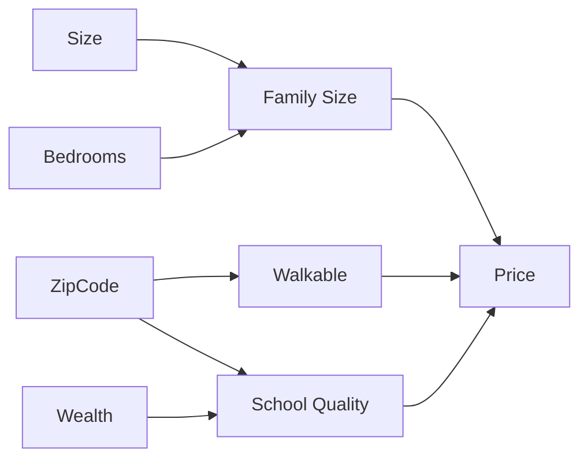

# CS229 — Deep Learning

## 1. Supervised Learning with Non-Linear Models

### 1.1 What is it?
So far, models like linear regression ($h_\theta(x)=\theta^Tx$) or regression with feature maps ($h_\theta(x)=\theta^T\phi(x)$) are **linear in the parameters** $\theta$. Deep learning studies models — **neural networks** — that are **non-linear in both** $\theta$ and $x$.

### 1.2 Cost Functions by Task Type

For training examples $\{(x^{(i)}, y^{(i)})\}_{i=1}^n$, the overall cost is always the average of a per-example loss:
$$
J(\theta) = \frac{1}{n}\sum_{i=1}^n J^{(i)}(\theta)
$$

**Regression** ($y \in \mathbb{R}$):
$$
J^{(i)}(\theta) = \frac{1}{2}\left(h_\theta(x^{(i)}) - y^{(i)}\right)^2
$$
Same mean-squared-error form as linear regression — only the parametrization of $h_\theta$ is different (now non-linear).

**Binary classification** ($y \in \{0,1\}$): The network outputs a raw score $\bar h_\theta(x) \in \mathbb{R}$ called the **logit**. The logistic function converts it into a probability:
$$
h_\theta(x) = g(\bar h_\theta(x)) = \frac{1}{1+\exp(-\bar h_\theta(x))}
$$
$$
P(y=1\mid x;\theta) = h_\theta(x), \qquad P(y=0\mid x;\theta) = 1-h_\theta(x)
$$
The per-example loss is the negative log-likelihood (same derivation as logistic regression):
$$
J^{(i)}(\theta) = -\log p(y^{(i)}\mid x^{(i)};\theta)
$$

**Multi-class classification** ($y \in \{1,\dots,k\}$): The network outputs $k$ logits $\bar h_\theta(x)\in\mathbb{R}^k$. The **softmax** function converts them into a probability distribution over classes:
$$
P(y=j\mid x;\theta) = \frac{\exp(\bar h_\theta(x)_j)}{\sum_{s=1}^k \exp(\bar h_\theta(x)_s)}
$$
Loss is again negative log-likelihood (cross-entropy):
$$
J^{(i)}(\theta) = -\log \frac{\exp(\bar h_\theta(x^{(i)})_{y^{(i)}})}{\sum_{s=1}^k \exp(\bar h_\theta(x^{(i)})_s)}
$$

| Task | Output of network | Conversion | Loss |
|---|---|---|---|
| Regression | $\bar h_\theta(x)\in\mathbb{R}$ | none, $h_\theta=\bar h_\theta$ | Squared error |
| Binary classification | logit $\bar h_\theta(x)\in\mathbb{R}$ | sigmoid | Negative log-likelihood (logistic loss) |
| Multi-class classification | logits $\bar h_\theta(x)\in\mathbb{R}^k$ | softmax | Negative log-likelihood (cross-entropy) |

> ⚠️ **Important:** This general recipe (logit → exponential-family distribution → negative log-likelihood loss) extends to any conditional distribution in the exponential family; regression, binary, and multi-class classification are just the three most common special cases.

### 1.3 Optimizers: Gradient Descent and SGD

**Gradient Descent (GD)** update rule:
$$
\theta := \theta - \alpha \nabla_\theta J(\theta)
$$
- $\alpha$ → learning rate (step size).
- Uses the *full* dataset's gradient at every step — expensive for large $n$.

**Stochastic Gradient Descent (SGD)** — updates using only one random example per step:

1. Initialize $\theta$ randomly.
2. For $i = 1$ to `n_iter`:
   - Sample $j$ uniformly from $\{1,\dots,n\}$.
   - Update: $\theta := \theta - \alpha \nabla_\theta J^{(j)}(\theta)$.

**Mini-batch SGD** — a middle ground, updating with the average gradient over a small batch of $B$ examples (sampled without replacement):
$$
\theta := \theta - \frac{\alpha}{B}\sum_{k=1}^B \nabla_\theta J^{(j_k)}(\theta)
$$

> 💡 **Intuition:** Computing gradients for $B$ examples together is often faster than computing them one at a time, due to hardware parallelization (e.g. GPUs) — this is why mini-batch SGD is the standard choice in practice, not just a compromise for statistical reasons.

**Typical deep learning workflow:**
```text
1. Define a neural network parametrization h_θ(x)
2. Derive an efficient gradient computation via backpropagation
3. Run (mini-batch) SGD to minimize J(θ)
```

---

## 2. Neural Networks

### 2.1 A Single Neuron

**Motivating example:** predicting house price from size, but preventing negative prices (a "kink" at zero). This single-kink function is represented as:
$$
\bar h_\theta(x) = \max(wx+b,\ 0), \qquad \theta=(w,b)
$$

This $\max(t,0)$ function is called **ReLU** (Rectified Linear Unit), denoted $\text{ReLU}(t)=\max\{t,0\}$. A one-dimensional non-linear function like ReLU is called an **activation function**.

For multi-dimensional input $x \in \mathbb{R}^d$:
$$
\bar h_\theta(x) = \text{ReLU}(w^Tx+b), \qquad w\in\mathbb{R}^d,\ b\in\mathbb{R}
$$
- $w$ → **weight vector**.
- $b$ → **bias**.

This is called a neural network with **1 layer**.

### 2.2 Stacking Neurons

> 💡 **Intuition:** Building neural networks is like stacking Lego bricks — individual neurons are combined so one neuron's output feeds into the next, producing increasingly complex functions.

**Example:** predicting house price from size, # bedrooms, zip code, and wealth. We might hand-design intermediate features "family size" ($a_1$), "walkable" ($a_2$), "school quality" ($a_3$), each a single-neuron function of a subset of inputs:
$$
a_1 = \text{ReLU}(\theta_1x_1+\theta_2x_2+\theta_3), \quad a_2=\text{ReLU}(\theta_4x_3+\theta_5), \quad a_3=\text{ReLU}(\theta_6x_3+\theta_7x_4+\theta_8)
$$
Then combine them linearly for the final output:
$$
\bar h_\theta(x) = \theta_9a_1+\theta_{10}a_2+\theta_{11}a_3+\theta_{12}
$$



- $a_1,a_2,a_3$ → **hidden units / hidden neurons** (intermediate variables).
- $\theta_1,\dots,\theta_{12}$ → all learnable parameters, collectively called $\theta$.

> ⚠️ **Important:** Biological inspiration: hidden units $a_i$ loosely correspond to neurons, and parameters $\theta_i$ to synapses. But it's unclear how similar modern deep networks (some with 1000+ layers) really are to biological brains, and whether the brain learns anything like backpropagation.

### 2.3 Two-Layer Fully-Connected Neural Networks

The hand-designed version above assumes prior knowledge (e.g., that "family size" depends only on size & bedrooms). A more flexible, generic approach: let each hidden unit depend on **all** inputs:
$$
a_1 = \text{ReLU}(w_1^Tx+b_1), \quad a_2=\text{ReLU}(w_2^Tx+b_2), \quad a_3=\text{ReLU}(w_3^Tx+b_3)
$$
This is called **fully-connected** because every hidden unit depends on every input.

**General definition** — two-layer fully-connected network with $m$ hidden units, input $x\in\mathbb{R}^d$:
$$
z_j = w_j^{[1]T}x+b_j^{[1]}, \quad a_j = \text{ReLU}(z_j), \quad \text{for } j=1,\dots,m
$$
$$
\bar h_\theta(x) = w^{[2]T}a + b^{[2]}
$$
- $w_j^{[1]}\in\mathbb{R}^d, b_j^{[1]}\in\mathbb{R}$ → parameters of the **first layer**.
- $a=[a_1,\dots,a_m]\in\mathbb{R}^m$ → the **hidden layer**.
- $w^{[2]}\in\mathbb{R}^m, b^{[2]}\in\mathbb{R}$ → parameters of the **second layer**.
- A two-layer network is also called a **one-hidden-layer** network.

### 2.4 Vectorization

> 💡 **Intuition:** Implementing the equations above with a `for` loop over hidden units works, but is far too slow for the high-dimensional inputs and large hidden layers used in practice. Vectorization replaces loops with matrix operations, exploiting optimized linear algebra libraries (BLAS) and GPU parallelism.

Stack all $w_j^{[1]}$ into a weight matrix $W^{[1]}\in\mathbb{R}^{m\times d}$ (each row is one $w_j^{[1]}$). Then:
$$
z = W^{[1]}x+b^{[1]}, \qquad a = \text{ReLU}(z)
$$
- $\text{ReLU}$ here is applied **element-wise**.
- With $W^{[2]}=[w^{[2]T}]\in\mathbb{R}^{1\times m}$, the full two-layer model becomes:
$$
a = \text{ReLU}(W^{[1]}x+b^{[1]}), \qquad \bar h_\theta(x) = W^{[2]}a+b^{[2]}
$$
- $\theta$ consists of the **weight matrices** $W^{[1]}, W^{[2]}$ and **biases** $b^{[1]}, b^{[2]}$.
- $\{W^{[1]}, b^{[1]}\}$ → first layer; $\{W^{[2]}, b^{[2]}\}$ → second layer.

### 2.5 Multi-Layer Fully-Connected Networks

With $r$ layers (weight matrices $W^{[1]},\dots,W^{[r]}$ and biases $b^{[1]},\dots,b^{[r]}$):
$$
a^{[1]} = \text{ReLU}(W^{[1]}x+b^{[1]})
$$
$$
a^{[2]} = \text{ReLU}(W^{[2]}a^{[1]}+b^{[2]})
$$
$$
\vdots
$$
$$
a^{[r-1]} = \text{ReLU}(W^{[r-1]}a^{[r-2]}+b^{[r-1]})
$$
$$
\bar h_\theta(x) = W^{[r]}a^{[r-1]}+b^{[r]}
$$

- If $a^{[k]}$ has dimension $m_k$, then $W^{[k]}\in\mathbb{R}^{m_k\times m_{k-1}}$ and $b^{[k]}\in\mathbb{R}^{m_k}$.
- Total neurons: $m_1+\dots+m_r$. Total parameters: $(d+1)m_1+(m_1+1)m_2+\dots+(m_{r-1}+1)m_r$.
- Using $a^{[0]}=x$ and $a^{[r]}=h_\theta(x)$, layers $1$ to $r-1$ follow the recursion $a^{[k]}=\text{ReLU}(W^{[k]}a^{[k-1]}+b^{[k]})$.

> ⚠️ **Important:** The **last layer typically has no ReLU** (it's kept linear), so the output can be negative and is easier to interpret as a linear model on top of learned features.

### 2.6 Other Activation Functions

| Name | Formula | Notes |
|---|---|---|
| Sigmoid | $\sigma(z)=\dfrac{1}{1+e^{-z}}$ | Bounded both sides; gradient vanishes at both extremes — less used today |
| Tanh | $\sigma(z)=\dfrac{e^z-e^{-z}}{e^z+e^{-z}}$ | Same vanishing-gradient issue as sigmoid |
| Leaky ReLU | $\sigma(z)=\max\{z,\gamma z\},\ \gamma\in(0,1)$ | Non-zero gradient even for negative input |
| GELU | $\sigma(z)=\frac{z}{2}\left(1+\text{erf}\left(\frac{z}{\sqrt2}\right)\right)$ | Smooth ReLU variant; used in BERT, GPT |
| Softplus | $\sigma(z)=\frac{1}{\beta}\log(1+\exp(\beta z))$ | Smooth ReLU approximation with a proper second derivative; not commonly used |

**Why not use the identity function $\sigma(z)=z$?** If $\sigma$ were linear, then for a two-layer network (with zero biases for simplicity):
$$
\bar h_\theta(x) = W^{[2]}a^{[1]} = W^{[2]}\sigma(z^{[1]}) = W^{[2]}z^{[1]} = W^{[2]}W^{[1]}x = \tilde{W}x
$$
where $\tilde W = W^{[2]}W^{[1]}$. A composition of linear functions is still linear — stacking layers would collapse into a single linear transformation, and the network would reduce to plain linear regression, losing all extra representational power.

### 2.7 Connection to the Kernel Method

Recall that feature maps $\phi(x)$ let linear models ($\theta^T\phi(x)$) represent non-linear functions, but $\phi(x)$ must be **hand-designed** (feature engineering).

Let $\beta$ denote all parameters of a fully-connected network *except* the last layer, so $a^{[r-1]} = \phi_\beta(x)$ can be viewed as a learned feature map. Then:
$$
\bar h_\theta(x) = W^{[r]}\phi_\beta(x) + b^{[r]}
$$

> 💡 **Intuition:** With $\beta$ fixed, this is just a linear model on features $\phi_\beta(x)$ — same as the kernel method. But during training, $\beta$ is **also learned**, so the network isn't just fitting a linear model — it's *simultaneously learning the feature map itself*. This is why deep learning tends to require less manual feature engineering.

The penultimate layer $a^{[r-1]}$ is informally called the **learned features / representations**. These learned features can be difficult for humans to interpret — hence neural networks are sometimes called a "black box."

```text
Feature Maps (Kernel Method)          Deep Learning
   φ(x) hand-designed         →       φ_β(x) learned jointly with W[r], b[r]
   θ^T φ(x), θ learned only   →       W[r] φ_β(x) + b[r], all parameters learned
```

---

## 3. Modules in Modern Neural Networks

### 3.1 Building Blocks

A **matrix multiplication module** with parameters $(W,b)$:
$$
\text{MM}_{W,b}(z) = Wz+b
$$

The MLP (multi-layer perceptron, i.e. the multi-layer network from Section 2.5) can be written as a composition of matrix-multiplication and activation modules:
$$
\text{MLP}(x) = \text{MM}(\sigma(\text{MM}(\sigma(\cdots\text{MM}(x)))))
$$
Each `MM` block has its own separate parameters. An activation layer $\sigma$ paired with one `MM` layer is often together called a "layer."

### 3.2 Residual Connections (ResNet)

A simplified **residual block**:
$$
\text{Res}(z) = z + \sigma(\text{MM}(\sigma(\text{MM}(z))))
$$
A simplified ResNet stacks many residual blocks, then a final matrix multiplication:
$$
\text{ResNet-S}(x) = \text{MM}(\text{Res}(\text{Res}(\cdots\text{Res}(x))))
$$

> 💡 **Intuition:** The `+ z` term lets the block learn a small adjustment on top of its input rather than an entire transformation from scratch — this is why residual connections are used in almost all large-scale deep architectures today.

> ⚠️ **Important:** This simplified ResNet-S differs from the original ResNet paper, which uses **convolution** layers (not plain matrix multiplication) and adds **batch normalization**. ResNet-S-style residual connections (plus layer normalization) are part of the Transformer architecture used in modern LLMs.

### 3.3 Layer Normalization

**Sub-module LN-S** normalizes a vector $z\in\mathbb{R}^m$ to zero mean, unit standard deviation:
$$
\text{LN-S}(z) = \left[\frac{z_1-\hat\mu}{\hat\sigma},\dots,\frac{z_m-\hat\mu}{\hat\sigma}\right], \qquad \hat\mu=\frac{1}{m}\sum_i z_i,\quad \hat\sigma=\sqrt{\frac{1}{m}\sum_i(z_i-\hat\mu)^2}
$$

> ⚠️ **Important:** The denominator uses $m$ (not $m-1$), since the goal is making the sum of squares of the output equal to 1 — this is *not* an unbiased statistical estimate of standard deviation.

Since zero-mean/unit-std isn't always the ideal scale, **layer norm** adds learnable scalars $\beta$ (target mean) and $\gamma$ (target std):
$$
\text{LN}(z) = \beta + \gamma\cdot\text{LN-S}(z)
$$
- $\beta,\gamma$ → **learnable parameters** (unlike a plain activation, which has none).

**Scale-invariance property:** Composing LN after a matrix multiplication makes the output invariant to scaling of that layer's weights:
$$
\text{LN}(\text{MM}_{\alpha W,\alpha b}(z)) = \text{LN}(\text{MM}_{W,b}(z)), \quad \forall \alpha>0
$$

*Why:* $\text{LN-S}$ itself is scale-invariant, since $\text{LN-S}(\alpha z) = \text{LN-S}(z)$ (both $\hat\mu$ and $\hat\sigma$ scale by $\alpha$, which cancels out). Since $\text{MM}_{\alpha W,\alpha b}(z) = \alpha\cdot \text{MM}_{W,b}(z)$, applying LN-S to it gives the same result as applying it to the unscaled version.

> 💡 **Intuition:** In practice, this means for most modern large-scale architectures, all layers except the last one (which usually has no normalization after it) are invariant to the scale of their own weights — scaling those weights up or down doesn't change the network's output.

Batch normalization and group normalization are alternative normalization schemes: batch/group norm are more common in computer vision, layer norm is more common in language models.

### 3.4 Convolutional Layers

Used heavily for computer vision (and also NLP for 1-D). Introduced here in 1-D for simplicity.

**Simplified 1-D convolution (Conv1D-S):** parameters are a filter vector $w\in\mathbb{R}^k$ (filter size $k=2\ell+1$, odd, typically $k\ll m$) and bias scalar $b$. The input $z$ is zero-padded, and each output entry is a weighted local combination:
$$
\text{Conv1D-S}(z)_i = \sum_{j=1}^{2\ell+1} w_j\, z_{i-\ell+(j-1)}
$$

> 💡 **Intuition:** This is just matrix multiplication with a **special structure**: the same small filter $w$ slides across the input, so weights are **shared** across positions (formally, $Q_{i,j}=Q_{i-1,j-1}$ in the equivalent matrix $Q$).

| Property | Generic Matrix Multiplication | Convolution (Conv1D-S) |
|---|---|---|
| Time complexity | $O(m^2)$ | $O(km)$ |
| Number of parameters | $m^2$ | $k$ |
| Parameter sharing | No | Yes |

> ⚠️ **Important:** Convolution is efficient (fewer parameters, faster) *as long as* the structural constraint (weight sharing, locality) doesn't hurt the model's ability to fit the data — this is a reasonable assumption for images/sequences where local patterns matter.

**Multi-channel Conv1D:** takes $C$ input vectors (channels) $z_1,\dots,z_C\in\mathbb{R}^m$ and produces $C'$ output channels, where each output channel is a **sum** of simplified convolutions applied across all input channels:
$$
\text{Conv1D}(z)_i = \sum_{j=1}^{C} \text{Conv1D-S}_{i,j}(z_j), \qquad \forall i\in[C']
$$
- Each $\text{Conv1D-S}_{i,j}$ has its own parameters → total parameters $= k \cdot C \cdot C'$ (vs. $m^2CC'$ for a generic linear map between the same shapes — convolution is far cheaper).
- Parameters can be viewed as a 3-D tensor of shape $k\times C\times C'$.

**2-D convolution (brief):** analogous, but the input is a 2-D map $z\in\mathbb{R}^{m\times m}$ (or a stack of $C$ such maps, i.e. a 3-D tensor $\mathbb{R}^{m\times m\times C}$) and the filter is $k\times k$:
$$
\text{Conv2D}(z)_i = \sum_{j=1}^{C}\text{Conv2D-S}_{i,j}(z_j), \qquad \forall i\in[C']
$$
- Total parameters: $C\cdot C' \cdot k^2$, viewable as a 4-D tensor of shape $C\times C'\times k\times k$.
- 2-D convolution suits images (2 spatial dimensions); 1-D convolution suits sequences (e.g. NLP).

---

# Key Takeaways

**Big picture flow:**
```text
Linear models (θ^Tx)
        ↓
Non-linear h_θ(x): still same loss-function recipe (squared error / logistic / softmax)
        ↓
Single neuron: ReLU(w^Tx + b)
        ↓
Stacked neurons → fully-connected multi-layer network (MLP)
        ↓
Vectorized form: a = ReLU(Wx+b), layers composed via matrix multiplication modules
        ↓
Modern building blocks: residual connections, layer norm, convolutions
        ↓
Trained via SGD/mini-batch SGD + backpropagation (gradient computation)
```

- **Loss functions by task**: regression → squared error; binary classification → sigmoid + negative log-likelihood; multi-class → softmax + cross-entropy. All are trained by minimizing the average per-example loss $J(\theta)=\frac{1}{n}\sum_i J^{(i)}(\theta)$.
- **SGD / mini-batch SGD**: approximate the true gradient using one example (or a small batch) at a time — mini-batches are preferred in practice mainly because of hardware parallelization (GPUs), not just statistical efficiency.
- **A single neuron** = one linear transformation ($w^Tx+b$) + one non-linear activation (e.g. ReLU). Stacking neurons into layers, and layers into a network, builds increasingly complex functions.
- **Fully-connected network**: every hidden unit depends on all inputs from the previous layer; vectorized via weight matrices $W^{[k]}$ and biases $b^{[k]}$, with $a^{[k]}=\text{ReLU}(W^{[k]}a^{[k-1]}+b^{[k]})$. The last layer usually skips the activation.
- **Non-linear activations are essential**: without them, any depth of stacked linear layers collapses into a single linear transformation — deep learning would reduce to linear regression.
- **Kernel-method connection**: a deep network is a linear model ($W^{[r]}\phi_\beta(x)+b^{[r]}$) on top of a feature map $\phi_\beta(x)$ that is *learned jointly* with the final linear weights — this is why deep learning needs less manual feature engineering than kernel methods, at the cost of interpretability ("black box").
- **Residual connections** ($z+\sigma(\text{MM}(\sigma(\text{MM}(z))))$) let each block learn a refinement rather than a full transformation, enabling very deep networks (e.g. ResNet, Transformers).
- **Layer normalization** rescales activations to a learnable mean/std ($\beta,\gamma$) and is invariant to the scale of the preceding layer's weights — most weights in modern architectures (except the last layer) inherit this scale-invariance.
- **Convolutional layers** are matrix multiplications with shared, local parameters (a sliding filter), making them far more parameter- and compute-efficient than generic dense layers for spatially/sequentially structured data (1-D for sequences, 2-D for images).
