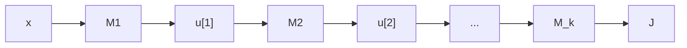

# CS229 — Backpropagation

## 1. Motivation

### 1.1 What is it?
**Backpropagation** (a.k.a. **auto-differentiation**) is the algorithm used to efficiently compute the gradient $\nabla J(\theta)$ of a neural network's loss. Without it, training deep networks would be computationally infeasible.

### 1.2 The Core Guarantee

> **Theorem 7.4.1 (informal):** If a real-valued function $f$ can be computed by a **differentiable circuit** of size $N$ (a composition of differentiable arithmetic operations and elementary functions like ReLU, exp, log, sin, cos — each computable, along with its derivative, in $O(1)$ time), then the gradient $\nabla f$ can also be computed in $O(N)$ time, by a circuit of similar size.

- Since the loss $J^{(j)}(\theta)$ for a single example is exactly such a composition (additions, multiplications, non-linear activations), this theorem guarantees we can compute $\nabla J^{(j)}(\theta)$ about **as fast as** we compute $J^{(j)}(\theta)$ itself.
- This applies not only to fully-connected MLPs but to any network built from differentiable modules (convolutions, layer norm, etc).

> ⚠️ **Important:** All modern deep learning frameworks (TensorFlow, PyTorch) already implement backpropagation automatically. In practice you rarely write it by hand — but understanding it gives insight into how training actually works.

---

## 2. Preliminaries on Partial Derivatives

### 2.1 Notation Convention
For a scalar $J$ depending on a variable $z$ (which may be a scalar, vector, matrix, or tensor), $\frac{\partial J}{\partial z}$ is defined to have **exactly the same shape as $z$**. E.g. if $z \in \mathbb{R}^{m\times n}$, then $\frac{\partial J}{\partial z}\in\mathbb{R}^{m\times n}$, with entry $(i,j)$ equal to $\frac{\partial J}{\partial z_{ij}}$.

> ⚠️ **Important:** This note only deals with derivatives of a **scalar** function with respect to vectors/matrices/tensors — never derivatives of a multi-variate (vector-valued) function, since those become expensive, hard-to-store tensors that are rarely needed in practice.

### 2.2 The Chain Rule

Consider a scalar $J$ built by composing two functions:
$$
z \in \mathbb{R}^m, \qquad u = g(z) \in \mathbb{R}^n, \qquad J = f(u) \in \mathbb{R}
$$

The standard chain rule gives, for each coordinate $z_i$:
$$
\frac{\partial J}{\partial z_i} = \sum_{j=1}^n \frac{\partial J}{\partial u_j}\cdot\frac{\partial g_j}{\partial z_i}
$$

In vectorized form:
$$
\frac{\partial J}{\partial z} = \begin{bmatrix}\frac{\partial g_1}{\partial z_1} & \cdots & \frac{\partial g_n}{\partial z_1}\\ \vdots & & \vdots \\ \frac{\partial g_1}{\partial z_m} & \cdots & \frac{\partial g_n}{\partial z_m}\end{bmatrix}\cdot\frac{\partial J}{\partial u}
$$

- This matrix is the **transpose of the Jacobian** of $g$.
- The formula for matrix/tensor $z$ (used later) is the direct generalization: $\frac{\partial J}{\partial z_{ik}} = \sum_j \frac{\partial J}{\partial u_j}\cdot\frac{\partial g_j}{\partial z_{ik}}$.

> 💡 **Intuition:** The chain rule is a linear map that takes $\frac{\partial J}{\partial u}$ (the gradient *after* module $g$) and produces $\frac{\partial J}{\partial z}$ (the gradient *before* module $g$) — and computing this map only requires knowing $g$ and the value of $z$, **not** anything about $f$, no matter how complex $f$ is:
$$
\frac{\partial J}{\partial u} \xrightarrow{\text{chain rule (only needs } g \text{ and } z\text{)}} \frac{\partial J}{\partial z}
$$
This is the key fact that makes backpropagation possible: each module can compute its own contribution to the gradient using only local information.

### 2.3 The Backward Function $\mathcal{B}[g,z]$

We give this chain-rule mapping a name: the **backward function** of module $g$, denoted $\mathcal{B}[g,z]$, mapping $\frac{\partial J}{\partial u} \to \frac{\partial J}{\partial z}$:
$$
\frac{\partial J}{\partial z} = \mathcal{B}[g,z]\left(\frac{\partial J}{\partial u}\right)
$$

For fixed $z$, $\mathcal{B}[g,z]$ is a linear map $\mathbb{R}^n \to \mathbb{R}^m$:
$$
(\mathcal{B}[g,z](v))_i = \sum_{j=1}^n \frac{\partial g_j}{\partial z_i}\cdot v_j
$$

> 💡 **Intuition:** In practice (e.g. PyTorch's `.backward()`), $\mathcal{B}[g,z](v)$ is implemented as a function that takes in $z$ (the input to $g$) and $v$ (a gradient vector "flowing back" from later in the network) and outputs the gradient with respect to $z$ — this is exactly what a `.backward()` method computes for a module.

---

## 3. General Strategy of Backpropagation

### 3.1 Networks as Module Compositions

A neural network's loss (for one example) can be viewed abstractly as a chain of simple building blocks — matrix multiplication (MM), activations ($\sigma$), convolutions, layer norm, and even the **loss function itself** is treated as a module:
$$
J = M_k(M_{k-1}(\cdots M_1(x)))
$$
Some modules have parameters $\theta^{[i]}$ (e.g. MM has $W, b$); others don't (e.g. a fixed activation).

**Example (binary classification MLP):** $M_1 = \text{MM}_{W^{[1]},b^{[1]}}$, $M_2=\sigma$, $M_3=\text{MM}_{W^{[2]},b^{[2]}}$, ..., $M_{k-1}=\text{MM}_{W^{[r]},b^{[r]}}$, $M_k = \text{logistic}$.

Define intermediate variables:
$$
u^{[0]}=x,\quad u^{[1]}=M_1(u^{[0]}),\quad u^{[2]}=M_2(u^{[1]}),\ \dots,\ J=u^{[k]}=M_k(u^{[k-1]})
$$

### 3.2 Forward Pass and Backward Pass

Backpropagation = **two passes**:

1. **Forward pass:** Compute $u^{[1]}, \dots, u^{[k]}$ sequentially (in increasing order), and **store all intermediate values** $u^{[i]}$ in memory.
2. **Backward pass:** Compute $\frac{\partial J}{\partial u^{[k]}}, \dots, \frac{\partial J}{\partial u^{[1]}}$ sequentially, in **decreasing** order, then compute parameter gradients $\frac{\partial J}{\partial \theta^{[i]}}$.

Using the chain rule (Section 2.2) with $u=u^{[i]}$, $z=u^{[i-1]}$, $g=M_i$:
$$
\frac{\partial J}{\partial u^{[i-1]}} = \mathcal{B}[M_i, u^{[i-1]}]\left(\frac{\partial J}{\partial u^{[i]}}\right) \tag{B1}
$$
And similarly for parameters, with $z=\theta^{[i]}$:
$$
\frac{\partial J}{\partial \theta^{[i]}} = \mathcal{B}[M_i,\theta^{[i]}]\left(\frac{\partial J}{\partial u^{[i]}}\right) \tag{B2}
$$


```text
Forward pass:  x → u[1] → u[2] → ... → u[k] = J   (store all u[i])
Backward pass: ∂J/∂u[k] → ∂J/∂u[k-1] → ... → ∂J/∂u[1]   (compute in reverse order)
                    ↓ (at each step, also extract)
               ∂J/∂θ[i]  for each module's parameters
```

> ⚠️ **Important:** $\frac{\partial J}{\partial \theta^{[i]}}$ can be computed as soon as $\frac{\partial J}{\partial u^{[i]}}$ is known — it does **not** need any $\frac{\partial J}{\partial u^{[k']}}$ for $k' < i$. So the two computations (B1) and (B2) can be interleaved rather than done in two fully separate sweeps.

### 3.3 Why This Is Efficient (Granularity)

> 💡 **Intuition:** Breaking a network into small modules works because the backward function of every *atomic* operation (addition, multiplication, ReLU) can be computed **just as cheaply** as evaluating the operation itself. This composability is exactly what Theorem 7.4.1 formalizes. In practice, it's more convenient to modularize at a coarser level (matrix multiplication, layer norm, etc.) — and as shown in Section 4, these larger modules also have backward functions with the same runtime as their forward evaluation.

---

## 4. Backward Functions for Basic Modules

### 4.1 Matrix Multiplication (MM)

For $\text{MM}_{W,b}(z) = Wz+b$, with $z\in\mathbb{R}^m$, $W\in\mathbb{R}^{n\times m}$:

**W.r.t. input $z$:** Using $\frac{\partial (Wz+b)_j}{\partial z_i} = W_{ji}$:
$$
\mathcal{B}[\text{MM},z](v) = W^Tv \in \mathbb{R}^m
$$

**W.r.t. weight $W$:** Using $\frac{\partial(Wz+b)_k}{\partial W_{ij}} = z_j$ if $k=i$, else $0$:
$$
\mathcal{B}[\text{MM},W](v) = vz^T \in \mathbb{R}^{n\times m}
$$

**W.r.t. bias $b$:** Since $\frac{\partial(Wz+b)_j}{\partial b_i}$ is $1$ if $i=j$, else $0$ (identity map):
$$
\mathcal{B}[\text{MM},b](v) = v
$$

> ⚠️ **Important:** All three backward functions for MM run in $O(mn)$ time — the same order as evaluating the matrix multiplication itself.

### 4.2 Element-wise Activation $\sigma$

For $M(z)=\sigma(z)$ applied element-wise, $z\in\mathbb{R}^m$: since $\frac{\partial \sigma(z_j)}{\partial z_i}=0$ for $j\neq i$, the Jacobian is **diagonal**:
$$
\mathcal{B}[\sigma,z](v) = \text{diag}(\sigma'(z_1),\dots,\sigma'(z_m))\, v = \sigma'(z)\odot v
$$
where $\odot$ denotes element-wise product.

> 💡 **Intuition:** Naively, this looks like an $O(m^2)$ matrix-vector product (diagonal matrix times $v$), but because the matrix is diagonal, it reduces to an $O(m)$ element-wise multiply — matching the cost of the forward pass. Using smaller (scalar-to-scalar) modules makes this efficiency obvious rather than surprising.

### 4.3 Loss Functions

For a module $M$ that maps a vector $z$ to a **scalar**, the backward function takes a scalar $v$ and returns a vector:
$$
\mathcal{B}[M,z](v) = \frac{\partial M}{\partial z}\cdot v
$$

| Loss | Formula | Backward function $\mathcal{B}[\cdot,z](v)$ |
|---|---|---|
| Squared error (MSE) | $\text{MSE}(z,y)=\frac12(z-y)^2$ | $(z-y)\cdot v$ |
| Logistic loss | (Section 2.1 form) | $\left(\frac{1}{1+e^{-t}} - y\right)\cdot v$ |
| Cross-entropy loss | (softmax-based, Section 2.3 form) | $(\phi - e_y)\cdot v$, where $\phi=\text{softmax}(t)$, $e_y$ = one-hot vector for class $y$ |

- For cross-entropy, $\phi - e_y$ is simply "predicted probability vector minus the one-hot true label" — a clean, interpretable gradient.

---

## 5. Backpropagation for MLPs (Putting It Together)

### 5.1 Forward Pass (r-layer MLP, logistic loss)
$$
z^{[1]} = \text{MM}_{W^{[1]},b^{[1]}}(x), \quad a^{[1]}=\sigma(z^{[1]})
$$
$$
z^{[2]} = \text{MM}_{W^{[2]},b^{[2]}}(a^{[1]}), \quad a^{[2]}=\sigma(z^{[2]})
$$
$$
\vdots
$$
$$
z^{[r]} = \text{MM}_{W^{[r]},b^{[r]}}(a^{[r-1]}), \qquad J = \text{logistic}(z^{[r]},y)
$$

### 5.2 Backward Pass

**Step 1 — start at the loss:**
$$
\frac{\partial J}{\partial z^{[r]}} = \mathcal{B}[\text{logistic},z^{[r]}](1) = \frac{1}{1+\exp(-z^{[r]})} - y
$$

**Step 2 — propagate backward through each layer** (using the backward functions from Section 4):
$$
\frac{\partial J}{\partial a^{[r-1]}} = \mathcal{B}[\text{MM},a^{[r-1]}]\left(\frac{\partial J}{\partial z^{[r]}}\right) = W^{[r]T}\frac{\partial J}{\partial z^{[r]}}
$$
$$
\frac{\partial J}{\partial z^{[r-1]}} = \mathcal{B}[\sigma,z^{[r-1]}]\left(\frac{\partial J}{\partial a^{[r-1]}}\right) = \sigma'(z^{[r-1]})\odot\frac{\partial J}{\partial a^{[r-1]}}
$$
$$
\vdots \quad\text{(repeat down to } \frac{\partial J}{\partial z^{[1]}}\text{)}
$$

> ⚠️ **Important:** The intermediate values $a^{[i]}$ and $z^{[i]}$ computed during the forward pass **must be stored in memory** — they are needed again during the backward pass (e.g., $\sigma'(z^{[i]})$ requires knowing $z^{[i]}$).

**Step 3 — extract parameter gradients** (can be interleaved with Step 2, as soon as the corresponding $\frac{\partial J}{\partial z^{[i]}}$ is available):
$$
\frac{\partial J}{\partial W^{[i]}} = \mathcal{B}[\text{MM},W^{[i]}]\left(\frac{\partial J}{\partial z^{[i]}}\right) = \frac{\partial J}{\partial z^{[i]}}\, a^{[i-1]T}
$$
$$
\frac{\partial J}{\partial b^{[i]}} = \mathcal{B}[\text{MM},b^{[i]}]\left(\frac{\partial J}{\partial z^{[i]}}\right) = \frac{\partial J}{\partial z^{[i]}}
$$

### 5.3 Full Algorithm

**Algorithm 3 — Backpropagation for multi-layer neural networks**

1. **Forward pass:** compute and store all $a^{[k]}$, $z^{[k]}$, and $J$.
2. **Initialize backward pass:**
   $$
   \frac{\partial J}{\partial z^{[r]}} = \frac{1}{1+\exp(-z^{[r]})} - y
   $$
3. **For $k = r-1$ down to $0$:**
   - Compute parameter gradients for layer $k+1$:
     $$
     \frac{\partial J}{\partial W^{[k+1]}} = \frac{\partial J}{\partial z^{[k+1]}}\, a^{[k]T}, \qquad \frac{\partial J}{\partial b^{[k+1]}} = \frac{\partial J}{\partial z^{[k+1]}}
     $$
   - If $k \geq 1$, propagate the gradient further back:
     $$
     \frac{\partial J}{\partial a^{[k]}} = W^{[k+1]T}\frac{\partial J}{\partial z^{[k+1]}}, \qquad \frac{\partial J}{\partial z^{[k]}} = \sigma'(z^{[k]})\odot\frac{\partial J}{\partial a^{[k]}}
     $$

```text
Forward:   x → z[1] → a[1] → z[2] → a[2] → ... → z[r] → J
Backward:  ∂J/∂z[r] → (∂J/∂W[r], ∂J/∂b[r]) → ∂J/∂a[r-1] → ∂J/∂z[r-1] → (∂J/∂W[r-1], ...) → ... → ∂J/∂z[1] → (∂J/∂W[1], ∂J/∂b[1])
```

> 💡 **Intuition:** Each layer's backward step reuses exactly two backward functions from Section 4 — $\mathcal{B}[\text{MM},\cdot]$ (a matrix transpose-multiply) and $\mathcal{B}[\sigma,\cdot]$ (an element-wise multiply) — repeated $r$ times. This is why the entire backward pass costs about the same as the forward pass: it's built from the same cheap, reusable pieces.

---

## 6. Vectorization Over Training Examples

### 6.1 The Idea

To exploit hardware parallelism, we compute the forward/backward pass for **many training examples at once**, using matrix notation instead of a `for` loop over examples.

For 3 examples $x^{(1)},x^{(2)},x^{(3)}$, stack them as **columns**:
$$
X = \begin{bmatrix}| & | & | \\ x^{(1)} & x^{(2)} & x^{(3)} \\ | & | & |\end{bmatrix} \in \mathbb{R}^{d\times 3}
$$

Then the first-layer pre-activations for all examples at once:
$$
Z^{[1]} = \begin{bmatrix}| & | & | \\ z^{[1](1)} & z^{[1](2)} & z^{[1](3)} \\ | & | & |\end{bmatrix} = W^{[1]}X + b^{[1]}
$$

> ⚠️ **Important:** Notation convention — square brackets $[\cdot]$ index the **layer**, parentheses $(\cdot)$ index the **training example**.

**On the bias addition:** strictly, $b^{[1]}\in\mathbb{R}^{4\times1}$ cannot be added to $W^{[1]}X\in\mathbb{R}^{4\times3}$ under standard linear algebra rules. In practice this is done via **broadcasting** — conceptually replicating $b^{[1]}$ into every column to form $\tilde b^{[1]}\in\mathbb{R}^{4\times3}$, then computing $Z^{[1]}=W^{[1]}X+\tilde b^{[1]}$. This generalizes directly to networks with multiple layers.

### 6.2 Row-Major vs. Column-Major Convention

> ⚠️ **Important — a common source of confusion:** These notes (like most deep learning *papers*) treat each data point as a **column** vector. But all deep learning **frameworks/code** (PyTorch, TensorFlow, etc.) store data points as **rows** of a data matrix (or along dimension 0, for tensor data).

**Conversion rule:** to go from the notes' convention to code convention — transpose everything: columns become rows, row vectors become column vectors, matrices are transposed, and the order of matrix multiplications is flipped.

| Notes convention (column-major) | Code convention (row-major) |
|---|---|
| $X \in \mathbb{R}^{d\times n}$ (examples as columns) | $X \in \mathbb{R}^{n\times d}$ (examples as rows) |
| $W^{[1]} \in \mathbb{R}^{m\times d}$ | $W^{[1]} \in \mathbb{R}^{d\times m}$ |
| $b^{[1]} \in \mathbb{R}^{m\times 1}$ | $b^{[1]} \in \mathbb{R}^{1\times m}$ |
| $Z^{[1]} = W^{[1]}X + b^{[1]}$ | $Z^{[1]} = XW^{[1]} + b^{[1]} \in \mathbb{R}^{n\times m}$ |

Both describe the exact same computation — only the storage/multiplication convention differs.

---

# Key Takeaways

**Big picture flow:**
```text
Network = composition of small differentiable modules (MM, σ, loss, ...)
        ↓
Chain rule: gradient w.r.t. a module's input only needs the module itself + its input value
        ↓
Backward function B[g,z]: reusable "local gradient" computation per module
        ↓
Forward pass: compute & store all intermediate u[i]'s (a[i], z[i])
        ↓
Backward pass: propagate ∂J/∂u[i] backward, extract ∂J/∂θ[i] along the way
        ↓
Vectorize over training examples (matrix form) for GPU efficiency
```

- **Core theorem:** if a function is computed by a differentiable circuit of size $N$, its gradient can be computed in $O(N)$ — i.e., backpropagation is (up to a constant factor) as cheap as the forward computation itself.
- **Chain rule as a local operation:** the gradient w.r.t. a module's input, $\frac{\partial J}{\partial z}$, can be computed from $\frac{\partial J}{\partial u}$ using only knowledge of that module ($g$) and its input ($z$) — no knowledge of anything downstream is needed. This locality is what makes modular backpropagation possible.
- **Backward function $\mathcal{B}[g,z]$:** the reusable "gradient translator" for a module — takes the gradient flowing in from later layers and produces the gradient to pass further back (and, for parametrized modules, the gradient w.r.t. that module's own parameters).
- **Two-pass algorithm:** forward pass computes and **stores** all intermediate activations; backward pass reuses them, moving from the loss back to the input, computing both activation gradients and parameter gradients (which can be interleaved).
- **Key backward functions (all as cheap as their forward pass):**
  - MM: $\mathcal{B}[\text{MM},z](v)=W^Tv$; $\mathcal{B}[\text{MM},W](v)=vz^T$; $\mathcal{B}[\text{MM},b](v)=v$.
  - Activation: $\mathcal{B}[\sigma,z](v)=\sigma'(z)\odot v$ (element-wise, despite looking like a matrix product).
  - Losses: MSE → $(z-y)v$; logistic → $(\hat p - y)v$; cross-entropy → $(\phi - e_y)v$ — all reduce to "prediction minus target."
- **MLP backprop algorithm** chains exactly these two backward functions ($\mathcal{B}[\text{MM},\cdot]$ and $\mathcal{B}[\sigma,\cdot]$) layer by layer, from the output back to the input.
- **Vectorization over examples:** stack examples as columns (notes' convention) or rows (code convention, used by all frameworks) to process a batch in one matrix operation instead of looping — critical for GPU speed. The two conventions are mathematically equivalent, related by transposition and flipped multiplication order.
