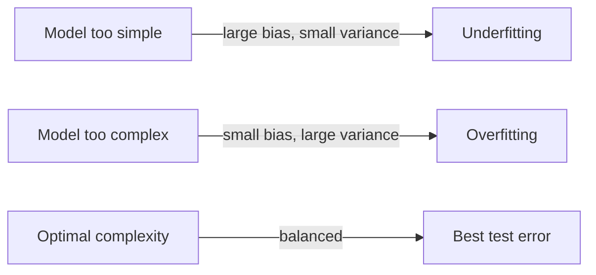

# CS229 — Generalization, Regularization & Model Selection

## 1. Training Error vs. Test Error

### 1.1 What is it?
We train a model $h_\theta$ by minimizing a loss $J(\theta)$ computed on the training set — this is called the **training loss/error**. But minimizing training loss is not the actual goal; it's a means to an end. The real goal is a small **test error**: performance on **unseen** examples.

### 1.2 Formal Definition

$$
L(\theta) = \mathbb{E}_{(x,y)\sim D}\left[(y-h_\theta(x))^2\right]
$$

- $D$ → the **test (population) distribution** the data comes from.
- In practice, $L(\theta)$ is approximated by averaging error over a held-out **test dataset**.
- Training loss is also called **empirical loss/risk**; test loss is also called **population loss/risk**.

> ⚠️ **Important:** Even when training and test data come from the **same** distribution $D$, the training set is *seen* by the learning procedure while the test set is *unseen* — so training error is not automatically close to test error. The gap between them is the **generalization gap**.

| Situation | Training error | Test error | Diagnosis |
|---|---|---|---|
| Overfitting | small | large | Model fits training data but doesn't generalize |
| Underfitting | large | large (usually) | Model fails to capture the data's structure at all |

---

## 2. Bias-Variance Tradeoff

### 2.1 Intuition via an Example

Suppose the true relationship is $y=h(x)+\xi$, a **quadratic** function $h$ plus Gaussian noise $\xi\sim N(0,\sigma^2)$.

- **Fitting a linear model:** Even with infinite training data, a straight line cannot represent a quadratic function. Training error stays large, and so does test error. This is **underfitting**, caused by **bias** — the model family is fundamentally too simple to capture the true structure, no matter how much data you have.
- **Fitting a 5th-degree polynomial:** This model *can* represent the true quadratic function (setting higher-order coefficients to zero recovers it). With a huge dataset, it would recover $h$ almost exactly. But on a **small** dataset, it achieves near-zero training error while doing poorly on test data — it fits the specific noise pattern of that dataset rather than the true underlying function. This is **overfitting**, caused by **variance** — the learned model is highly sensitive to which particular (finite) training set was drawn.

> 💡 **Intuition:** Bias = error from a model family that is too simple to represent the truth, even with unlimited data. Variance = error from a model that is flexible enough to represent the truth, but ends up fitting noise/spurious patterns specific to one particular training set. Fitting 5th-degree polynomials to *different* training sets (drawn from the same distribution) produces noticeably *different* fitted curves — that variability across datasets *is* the variance.

```text
Model too simple  -> large bias,     small variance -> underfitting
Model too complex -> small bias,     large variance -> overfitting
Model "just right"-> balanced bias & variance -> best test error
```

### 2.2 Mathematical Decomposition (Regression)

**Setup:**
- Training set $S=\{x^{(i)},y^{(i)}\}_{i=1}^n$ with $y^{(i)}=h(x^{(i)})+\xi^{(i)}$, $\xi^{(i)}\sim N(0,\sigma^2)$.
- Model trained on $S$: $\hat h_S$.
- Test point $(x,y)$ with $y=h(x)+\xi$, $\xi\sim N(0,\sigma^2)$.
- Expected test error at $x$ (averaged over the randomness of $S$ and $\xi$):
$$
\text{MSE}(x) = \mathbb{E}_{S,\xi}\left[(y-h_S(x))^2\right]
$$

**Tool used twice — Claim 8.1.1:** If $A,B$ are independent, $\mathbb{E}[A]=0$, then $\mathbb{E}[(A+B)^2]=\mathbb{E}[A^2]+\mathbb{E}[B^2]$. (Cross term $2\mathbb{E}[AB]=2\mathbb{E}[A]\mathbb{E}[B]=0$ by independence.)

**Step 1 — split off the irreducible noise.** Apply the claim with $A=\xi$, $B=h(x)-h_S(x)$:
$$
\text{MSE}(x) = \mathbb{E}[(\xi + (h(x)-h_S(x)))^2] = \sigma^2 + \mathbb{E}[(h(x)-h_S(x))^2]
$$

**Step 2 — introduce the "average model".** Define $h_{avg}(x)=\mathbb{E}_S[h_S(x)]$: the hypothetical model obtained by averaging predictions from infinitely many independently-trained models. Apply the claim again, this time with $c=h(x)-h_{avg}(x)$ (a constant, independent of $S$) and $A=h_{avg}(x)-h_S(x)$:

$$
\text{MSE}(x) = \underbrace{\sigma^2}_{\text{unavoidable}} + \underbrace{(h(x)-h_{avg}(x))^2}_{\text{bias}^2} + \underbrace{\text{var}(h_S(x))}_{\text{variance}}
$$

| Term | Meaning |
|---|---|
| $\sigma^2$ | Irreducible noise — cannot be reduced by any model or amount of data. |
| $(h(x)-h_{avg}(x))^2$ (**bias²**) | Error from the model family's fundamental inability to represent $h$, even with infinite data. |
| $\text{var}(h_S(x))$ (**variance**) | Error from the model's sensitivity to which particular finite dataset $S$ was drawn. |

> 💡 **Intuition:** $h_{avg}$ represents "the best a model family could ever do, given unlimited data to average away sampling noise." If $h_{avg}$ is still far from the truth $h$ (as with linear models trying to fit a quadratic), the bias is fundamentally large — no amount of additional data fixes it. Variance, by contrast, typically **shrinks as dataset size grows**, since more data means less sensitivity to any one sample's particular noise.

> ⚠️ **Important:** This clean bias-variance decomposition is specific to **regression** (squared error). For classification, no single agreed-upon decomposition exists.

### 2.3 The Tradeoff



As model complexity increases: bias tends to decrease, variance tends to increase. Test error = bias² + variance + $\sigma^2$, so it typically forms a **convex (U-shaped) curve** as complexity increases — there is a sweet spot. In the quadratic-truth example, the quadratic model itself achieves the best tradeoff (small bias *and* small variance), beating both the linear and 5th-degree fits.

---

## 3. The Double Descent Phenomenon

### 3.1 Model-wise Double Descent

> ⚠️ **Important:** The classical bias-variance curve (Section 2.3) is not universal. Empirically, test error can show a **second descent**: it decreases, then increases to a peak (roughly when model size is just large enough to fit the training data perfectly), and then **decreases again** in the **overparameterized regime** (# parameters > # data points).

```text
classical regime (bias-variance tradeoff) | modern regime (overparameterization)
   test error decreases, then increases   |   test error decreases again
                          peak around # parameters ≈ # training examples
```

**Practical implication:** don't be afraid to scale up overparameterized models — test error often keeps improving well past the point where the model can perfectly fit the training set.

### 3.2 Sample-wise Double Descent

A related, non-intuitive phenomenon: test error is **not monotonically decreasing** in the number of training examples $n$. It decreases, then **increases** and peaks around $n\approx d$ (where $d$ = number of parameters), then decreases again.

> 💡 **Intuition:** Both model-wise and sample-wise double descent peak at the same place: $n\approx d$. This suggests the peak isn't fundamental — it reflects that common training algorithms (e.g., unregularized ERM) are **suboptimal** specifically in the $n\approx d$ regime. With **optimally-tuned regularization**, the peak is dramatically reduced or eliminated for both versions.

### 3.3 Why Does the Second Descent Happen?

An active research question, but a leading explanation is **implicit regularization** by the optimizer (see Section 6): even without an explicit regularizer, gradient-based optimizers (e.g., gradient descent with zero initialization) tend to converge to a "simple" solution — e.g., for overparameterized linear models, the **minimum-norm** solution that fits the data, rather than an arbitrary one. This implicit bias behaves like a good regularizer specifically in the overparameterized regime.

> ⚠️ **Important:** Double descent is typically observed when complexity is measured by **number of parameters**. If instead you plot test error against the **norm** of the learned model, the double-descent shape often disappears and looks more like the classical bias-variance curve — because the norm of the learned model is itself what peaks around $n\approx d$. For deep networks, the "correct" complexity measure remains unclear, and this is an active research area.

---

## 4. Sample Complexity Bounds (Learning Theory)

### 4.1 Motivating Questions
1. Can the bias/variance tradeoff be made mathematically rigorous?
2. Since we only optimize training error, why should that say anything about generalization error?
3. Under what conditions can we *prove* a learning algorithm works?

### 4.2 Two Key Lemmas

**Union bound:** for any events $A_1,\dots,A_k$ (possibly dependent):
$$
P(A_1\cup\dots\cup A_k) \leq P(A_1)+\dots+P(A_k)
$$

**Hoeffding inequality (Chernoff bound):** for $Z_1,\dots,Z_n$ iid $\text{Bernoulli}(\phi)$, and $\hat\phi=\frac1n\sum_i Z_i$, for any $\gamma>0$:
$$
P(|\phi-\hat\phi|>\gamma) \leq 2\exp(-2\gamma^2 n)
$$
> 💡 **Intuition:** the empirical average of many coin flips is a good estimate of the true bias $\phi$, and the probability of being far off shrinks **exponentially** as $n$ grows.

### 4.3 Setup: Empirical Risk Minimization (ERM)

For binary classification $y\in\{0,1\}$, training set $S$ drawn iid from $D$:

**Training error (empirical risk):**
$$
\hat\varepsilon(h) = \frac1n\sum_{i=1}^n \mathbb{1}\{h(x^{(i)})\neq y^{(i)}\}
$$

**Generalization error:**
$$
\varepsilon(h) = P_{(x,y)\sim D}(h(x)\neq y)
$$

**Empirical Risk Minimization (ERM):** pick $\hat h = \arg\min_{h\in\mathcal{H}} \hat\varepsilon(h)$, where $\mathcal{H}$ is the **hypothesis class** (the full set of classifiers the algorithm considers, e.g. all linear classifiers).

### 4.4 The Case of Finite $\mathcal{H}$

For a fixed $h_i\in\mathcal{H}$: since $\hat\varepsilon(h_i)$ is an average of $n$ iid Bernoulli$(\varepsilon(h_i))$ variables, Hoeffding gives:
$$
P(|\varepsilon(h_i)-\hat\varepsilon(h_i)|>\gamma) \leq 2\exp(-2\gamma^2n)
$$

This holds for *one* fixed hypothesis. To make it hold **simultaneously for all** $h\in\mathcal{H}=\{h_1,\dots,h_k\}$, apply the union bound over the "bad" events $A_i$:
$$
P(\exists h\in\mathcal{H}: |\varepsilon(h)-\hat\varepsilon(h)|>\gamma) \leq 2k\exp(-2\gamma^2n)
$$

Equivalently, with probability at least $1-2k\exp(-2\gamma^2n)$, **uniform convergence** holds: $|\varepsilon(h)-\hat\varepsilon(h)|\leq\gamma$ for *every* $h\in\mathcal{H}$ at once.

**Sample complexity:** setting $\delta=2k\exp(-2\gamma^2n)$ and solving for $n$:
$$
n \geq \frac{1}{2\gamma^2}\log\frac{2k}{\delta}
$$
guarantees uniform convergence within $\gamma$ with probability $\geq 1-\delta$.

> ⚠️ **Important:** the required $n$ grows only **logarithmically** in $k$ (the size of the hypothesis class) — this is a very mild dependence, and will matter for the infinite-$\mathcal{H}$ case.

**From uniform convergence to a guarantee on $\hat h$:** let $h^*=\arg\min_{h\in\mathcal{H}}\varepsilon(h)$ (best possible hypothesis in the class). Then:
$$
\varepsilon(\hat h) \leq \hat\varepsilon(\hat h)+\gamma \leq \hat\varepsilon(h^*)+\gamma \leq \varepsilon(h^*)+2\gamma
$$
(First and third steps use uniform convergence; the middle step uses that $\hat h$ minimizes $\hat\varepsilon$ over $\mathcal{H}$, so in particular it beats $h^*$ on the training set.)

**Theorem:** with probability at least $1-\delta$:
$$
\varepsilon(\hat h) \leq \min_{h\in\mathcal{H}}\varepsilon(h) + 2\sqrt{\frac{1}{2n}\log\frac{2k}{\delta}}
$$

> 💡 **Intuition — formalizing bias/variance in model selection:** Switching to a **larger** hypothesis class $\mathcal{H}'\supseteq\mathcal{H}$ can only *decrease* $\min_h\varepsilon(h)$ (more functions to choose from) — this is a decrease in **bias**. But $k$ grows, so the $\sqrt{\cdot}$ term grows too — an increase in **variance**. This is the VC-theory version of the bias-variance tradeoff.

**Sample complexity corollary:** to guarantee $\varepsilon(\hat h)\leq\min_h\varepsilon(h)+2\gamma$ with probability $\geq1-\delta$, it suffices that:
$$
n \geq \frac{1}{2\gamma^2}\log\frac{2k}{\delta} = O\left(\frac{1}{\gamma^2}\log\frac{k}{\delta}\right)
$$

### 4.5 The Case of Infinite $\mathcal{H}$ (Continuous Parameters)

**A rough (not fully satisfying) argument:** representing $d$ real parameters with 64-bit floats gives at most $k=2^{64d}$ distinct hypotheses. Plugging into the corollary above:
$$
n = O\left(\frac{d}{\gamma^2}\log\frac{1}{\delta}\right) = O_{\gamma,\delta}(d)
$$
So sample complexity is roughly **linear in the number of parameters** $d$. This argument is unsatisfying because it depends on an arbitrary bit-precision choice, and the same hypothesis class can be *re-parameterized* with a different number of parameters (e.g. $\theta_i \to u_i^2-v_i^2$ doubles the parameter count without changing $\mathcal{H}$).

### 4.6 VC Dimension: A Parameterization-Free Measure

**Shattering:** $\mathcal{H}$ *shatters* a set of points $S=\{x^{(1)},\dots,x^{(D)}\}$ if, for **every** possible labeling of these points, some $h\in\mathcal{H}$ achieves that labeling exactly.

**VC dimension** $VC(\mathcal{H})$ = size of the **largest** set that $\mathcal{H}$ can shatter (or $\infty$ if arbitrarily large sets can be shattered).

**Example:** linear classifiers in 2D can shatter any 3 points in "general position" (not collinear) — all $2^3=8$ labelings are achievable — so $VC(\mathcal{H})\geq 3$. No set of 4 points can be shattered by 2D linear classifiers, so $VC(\mathcal{H})=3$.

> ⚠️ **Important:** VC dimension only requires **one** shatterable set of that size to exist — it doesn't need to shatter *every* set of that size. E.g., 3 collinear points *cannot* be shattered by linear classifiers, but that doesn't reduce $VC(\mathcal{H})$ below 3, since some other 3-point set *can* be shattered.

**Vapnik's Theorem:** with $D=VC(\mathcal{H})$, with probability $\geq1-\delta$, for **all** $h\in\mathcal{H}$:
$$
|\varepsilon(h)-\hat\varepsilon(h)| \leq O\left(\sqrt{\frac{D}{n}\log\frac{n}{D}} + \sqrt{\frac1n\log\frac1\delta}\right)
$$
and consequently $\varepsilon(\hat h)\leq \varepsilon(h^*) + O(\cdot)$ (same bound).

**Corollary:** the sample complexity needed for uniform convergence within $\gamma$ is $n=O_{\gamma,\delta}(D)$ — **linear in VC dimension**.

> 💡 **Intuition:** For "most" reasonably-parameterized hypothesis classes, VC dimension is roughly linear in the number of parameters — recovering, but now rigorously (without depending on floating-point bit-width or a specific parameterization), the earlier conclusion: **sample complexity ≈ linear in the number of parameters**, for algorithms that minimize training error.

---

## 5. Regularization

### 5.1 What is it?
A technique to control model complexity and prevent overfitting by adding a penalty term to the training loss:
$$
J_\lambda(\theta) = J(\theta) + \lambda R(\theta)
$$
- $R(\theta)$ → the **regularizer**, a nonnegative measure of model complexity.
- $\lambda\geq0$ → the **regularization parameter**, controlling the tradeoff between fitting the data (small $J(\theta)$) and keeping the model simple (small $R(\theta)$).

> ⚠️ **Important:** $\lambda=0$ recovers the original unregularized loss. Very large $\lambda$ makes the data-fit term ineffective, risking large **bias**.

### 5.2 $L_2$ Regularization (Weight Decay)

$R(\theta)=\frac12\|\theta\|_2^2$. Gradient descent on the regularized loss:
$$
\theta \leftarrow \theta - \eta\nabla J_\lambda(\theta) = \theta - \eta\lambda\theta - \eta\nabla J(\theta) = \underbrace{(1-\eta\lambda)\theta}_{\text{decaying weights}} - \eta\nabla J(\theta)
$$
- Every step **shrinks** $\theta$ by a factor $(1-\eta\lambda)$ before applying the usual gradient step — hence the name **weight decay** in deep learning.

### 5.3 $L_1$ Regularization (Sparsity / LASSO)

If we believe the true parameters are **sparse** (few non-zero entries — the model depends on only a handful of input coordinates), we'd like to regularize $\|\theta\|_0$ (count of non-zeros) directly. But $\|\theta\|_0$ is not continuous, so it can't be optimized with (stochastic) gradient descent.

**Common relaxation:** $R(\theta)=\|\theta\|_1$ (LASSO) — a continuous surrogate that still encourages sparsity in practice.

| Regularizer | Formula | Encourages | Compatible with kernels? |
|---|---|---|---|
| $L_2$ | $\frac12\|\theta\|_2^2$ | Small-norm (simple) models | Yes — commonly used with kernel methods |
| $L_1$ (LASSO) | $\|\theta\|_1$ | Sparse models (many zero coefficients) | No — optimal solution generally can't be written purely via inner products |

> ⚠️ **Important:** Imposing structure (like sparsity) narrows the search space, which *tends* to reduce variance/improve generalization — but if the true relationship genuinely needs the excluded structure, imposing it too strongly increases **bias**, just like fitting only linear models to quadratic data.

### 5.4 Other Deep Learning Regularizers

Beyond $L_2$/weight decay: **dropout**, **data augmentation**, regularizing the **spectral norm** of weight matrices, regularizing the model's **Lipschitzness**, and others — an active area of research.

---

## 6. Implicit Regularization

### 6.1 What is it?
A phenomenon specific to the deep learning era: **the choice of optimizer** can bias which global minimum is found, even when the (regularized) loss has **multiple** global minima with the same training loss but different generalization performance.

> 💡 **Intuition:** In classical settings, the loss has a *unique* global minimum, so any reasonable optimizer converges to the same place. In deep learning, many different parameter settings can achieve near-zero training loss, but they can differ dramatically in test performance — and different optimizers (or different hyperparameters of the same optimizer) tend to land in different such minima.

### 6.2 Empirical Observations

Changing only the **learning rate schedule** (same regularized loss, same architecture, both fitting training data perfectly) can produce models with very different generalization. Similarly for different **initializations**.

**Heuristics that tend to favor better-generalizing solutions** (not universal, but observed in many settings): larger initial learning rate, smaller initialization, smaller batch size, and momentum.

> ⚠️ **Important:** A leading conjecture (provable in simplified cases) is that **stochasticity** in optimization biases the search toward **flatter** global minima (low loss curvature), and flat minima tend to correspond to more Lipschitz, better-generalizing models. This remains an active, open research area — formally characterizing implicit regularization is still unsolved.

**Connection to double descent (Section 3.3):** in the overparameterized regime, gradient descent's implicit bias toward, e.g., the minimum-norm solution acts as a free regularizer, helping explain the second descent.

---

## 7. Model Selection via Cross-Validation

### 7.1 The Problem
Given several candidate models $\mathcal{M}=\{M_1,\dots,M_d\}$ (e.g., polynomial degree, SVM's $C$, or entirely different algorithms), how do we pick the best one?

> ⚠️ **Important:** Picking the model with the smallest **training** error does not work — it always favors the most complex model in the set (e.g., highest polynomial degree), since more flexible models can always fit training data at least as well.

### 7.2 Hold-Out Cross Validation

1. Randomly split $S$ into $S_{train}$ (e.g., 70%) and $S_{cv}$ (the remaining 30%, the **hold-out validation set**).
2. Train each model $M_i$ on $S_{train}$ only, getting hypothesis $h_i$.
3. Select the $h_i$ with smallest error $\hat\varepsilon_{S_{cv}}(h_i)$ on the **held-out** set (the **validation error**).

- Typically 1/4–1/3 of data is held out; for very large datasets (e.g. ImageNet), a much smaller *fraction* (but still large absolute count) suffices.
- **Optional retraining:** after selecting the best $M_i$, retrain it on the **full** set $S$ (train + validation) — usually beneficial, except for algorithms very sensitive to perturbations of initial conditions/data.

> ⚠️ **Important:** Hold-out cross-validation "wastes" ~30% of the data — models are only trained on 0.7$n$ examples during selection, which matters when data is scarce.

### 7.3 k-Fold Cross Validation

1. Randomly split $S$ into $k$ disjoint subsets $S_1,\dots,S_k$ of size $n/k$ each.
2. For each model $M_i$: for $j=1,\dots,k$, train on all folds except $S_j$, evaluate on $S_j$ to get $\hat\varepsilon_{S_j}(h_{ij})$. Average these $k$ errors → estimated generalization error for $M_i$.
3. Pick the $M_i$ with lowest average error; retrain on the **entire** set $S$.

- Typical choice: $k=10$.
- Holds out only $1/k$ of the data each round (vs. 30% for hold-out CV), but costs $k\times$ more training runs.

### 7.4 Leave-One-Out Cross Validation

The extreme case $k=n$: train on all but one example, test on that one, repeat for every example, average the $n$ errors. Leaves out as little data as possible per round — useful when data is extremely scarce, but the most computationally expensive option.

| Method | Data held out per round | Training runs | Best used when |
|---|---|---|---|
| Hold-out CV | ~30% | 1 per model | Data is abundant |
| k-fold CV | $1/k$ | $k$ per model | Moderate data, want less waste |
| Leave-one-out | $1/n$ | $n$ per model | Data is very scarce |

> 💡 **Intuition:** All three variants are really the same idea — estimate generalization error by testing on data the model didn't see — just trading off how much data is "wasted" per round against how many times you must retrain.

Cross-validation is also useful simply to **evaluate** a single algorithm's performance (e.g., for reporting results), not just for choosing between models.

---

## 8. Bayesian Statistics and Regularization

### 8.1 Frequentist vs. Bayesian View

**Frequentist (MLE):** $\theta$ is an unknown but *fixed* constant of the world:
$$
\theta_{MLE} = \arg\max_\theta \prod_{i=1}^n p(y^{(i)}\mid x^{(i)};\theta)
$$

**Bayesian:** $\theta$ is treated as a **random variable** with a prior distribution $p(\theta)$ expressing beliefs before seeing data. Given training set $S$, compute the **posterior**:
$$
p(\theta\mid S) = \frac{p(S\mid\theta)p(\theta)}{p(S)} = \frac{\left(\prod_{i=1}^n p(y^{(i)}\mid x^{(i)},\theta)\right)p(\theta)}{\int_\theta \left(\prod_{i=1}^n p(y^{(i)}\mid x^{(i)},\theta)\right)p(\theta)\,d\theta}
$$

**Prediction for a new $x$** — average over the *entire* posterior distribution, not a single point estimate:
$$
p(y\mid x,S) = \int_\theta p(y\mid x,\theta)\,p(\theta\mid S)\,d\theta
$$
This "fully Bayesian" approach is often **computationally intractable** (high-dimensional integrals with no closed form).

### 8.2 MAP Estimation — A Practical Approximation

Instead of the full posterior, use a single **point estimate**: the **maximum a posteriori (MAP)** estimate:
$$
\theta_{MAP} = \arg\max_\theta \prod_{i=1}^n p(y^{(i)}\mid x^{(i)},\theta)\, p(\theta)
$$

- Identical to the MLE formula, **except** for the extra prior term $p(\theta)$.

### 8.3 Connection to $L_2$ Regularization

A common choice: $\theta \sim N(0,\tau^2I)$ as the prior. This makes $\theta_{MAP}$ have **smaller norm** than $\theta_{MLE}$ — i.e., a Gaussian prior on $\theta$ is mathematically equivalent to adding an **$L_2$ regularizer**.

> 💡 **Intuition:** MAP estimation with a Gaussian prior is literally $L_2$-regularized MLE — the "prior belief that parameters are small" (Bayesian language) and "penalize large $\|\theta\|_2^2$" (regularization language) are the same mechanism viewed from two different philosophical framings.

This is why **Bayesian logistic regression** tends to resist overfitting even when $d\gg n$ (e.g., text classification) — the prior acts exactly like a regularizer.

```text
Bayesian view: prior p(θ) ~ N(0, τ²I)
        ↓  (MAP estimation)
Frequentist view: L2-regularized loss, λ related to 1/τ²
```

---

# Key Takeaways

**Big picture flow:**
```text
Training error vs. test error
        ↓
Bias-variance decomposition (why test error can exceed training error)
        ↓
Double descent (classical intuition breaks down in overparameterized regime)
        ↓
VC theory (rigorous sample-complexity version of the bias-variance tradeoff)
        ↓
Regularization (explicit control of model complexity: L1/L2)
        ↓
Implicit regularization (optimizer choice also controls complexity)
        ↓
Cross-validation (practical, algorithm-agnostic way to pick model complexity)
        ↓
Bayesian view (prior distributions ↔ regularizers, e.g. Gaussian prior ↔ L2)
```

- **Training vs. test error:** training error (empirical risk) is what we optimize; test error (population risk) is what actually matters. They can diverge because training data is *seen* and test data is *unseen*, even when drawn from the same distribution.
- **Bias-variance decomposition** (regression): $\text{MSE}(x) = \sigma^2 + \text{bias}^2 + \text{variance}$. Bias = error from a model family too simple to represent the truth even with infinite data; variance = error from sensitivity to the specific finite training sample. More complexity → less bias, more variance.
- **Double descent:** test error vs. model size (or sample size) can show a *second* descent after the classical U-shape, peaking near $n\approx d$ and then improving again in the overparameterized regime — implicit regularization by the optimizer is a leading explanation.
- **VC dimension** rigorously formalizes "model complexity" without depending on a specific parameterization; sample complexity needed for good generalization is roughly **linear in VC dimension** (and, for typical models, roughly linear in parameter count too).
- **Explicit regularization** ($J_\lambda(\theta)=J(\theta)+\lambda R(\theta)$): $L_2$ (weight decay) shrinks parameters toward zero smoothly; $L_1$ (LASSO) encourages exact sparsity but isn't kernel-compatible.
- **Implicit regularization:** even without an explicit regularizer, the optimizer's own dynamics (learning rate, batch size, initialization, momentum) bias which solution is found among many equally-good-on-training-data optima — this is a distinctly modern (deep learning era) consideration.
- **Cross-validation** (hold-out / k-fold / leave-one-out) estimates generalization error using held-out data, letting you select model complexity (or any hyperparameter) without the "always pick the most complex model" failure of training-error-based selection.
- **Bayesian MAP estimation** with a Gaussian prior $N(0,\tau^2I)$ is mathematically the same as $L_2$-regularized maximum likelihood — priors and regularizers are two languages for the same idea: encoding a preference for "simpler" parameter values.
