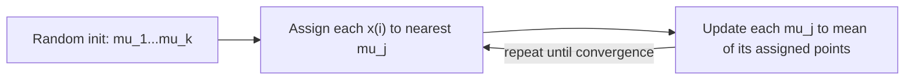

# CS229 — Clustering (K-Means) & the EM Algorithm

## 1. Clustering and the K-Means Algorithm

### 1.1 What is it?
**Clustering** groups a training set $\{x^{(1)},\dots,x^{(n)}\}$ (with $x^{(i)}\in\mathbb{R}^d$) into a few cohesive "clusters" — **without any labels** $y^{(i)}$. This makes clustering an **unsupervised learning** problem.

### 1.2 The K-Means Algorithm

**Goal:** find $k$ cluster centroids $\mu_1,\dots,\mu_k\in\mathbb{R}^d$ (positions of cluster centers) and assign each point to one.

**Algorithm:**
1. Initialize centroids $\mu_1,\dots,\mu_k$ randomly (e.g., set them equal to $k$ randomly chosen training examples).
2. Repeat until convergence:
   - **Assignment step:** for every $i$, assign point $x^{(i)}$ to its closest centroid:
     $$
     c^{(i)} := \arg\min_j \|x^{(i)}-\mu_j\|^2
     $$
   - **Update step:** for each $j$, move the centroid to the mean of all points currently assigned to it:
     $$
     \mu_j := \frac{\sum_{i=1}^n \mathbb{1}\{c^{(i)}=j\}\,x^{(i)}}{\sum_{i=1}^n \mathbb{1}\{c^{(i)}=j\}}
     $$

> 💡 **Intuition:** each iteration alternates between "which centroid is each point closest to?" and "given the current assignments, where should each centroid actually sit?" — repeating this converges to a set of centroids that are self-consistent with their assigned points.



### 1.3 Why Does K-Means Converge?

Define the **distortion function**:
$$
J(c,\mu) = \sum_{i=1}^n \|x^{(i)} - \mu_{c^{(i)}}\|^2
$$
- $J$ → sum of squared distances between each point and the centroid it's currently assigned to.

**Key fact:** K-means is exactly **coordinate descent** on $J$:
- The assignment step minimizes $J$ with respect to $c$, holding $\mu$ fixed.
- The update step minimizes $J$ with respect to $\mu$, holding $c$ fixed.

Since each step can only decrease (never increase) $J$, $J$ decreases **monotonically** and must converge to some value. (This usually also means $c$ and $\mu$ themselves converge, though in theory K-means could oscillate between a few different clusterings sharing the same $J$ value — extremely rare in practice.)

> ⚠️ **Important:** $J$ is **non-convex**, so coordinate descent on $J$ is only guaranteed to reach a **local** optimum, not necessarily the global one. K-means can get stuck in bad local minima. A common fix: run K-means multiple times with different random initializations, and keep the clustering with the lowest final $J(c,\mu)$.

---

## 2. The EM Algorithm for a Mixture of Gaussians

### 2.1 What is it?
The **EM (Expectation-Maximization) algorithm** performs **density estimation**: given unlabeled data $\{x^{(1)},\dots,x^{(n)}\}$, we model it as generated by a **mixture of Gaussians** — a soft, probabilistic version of clustering.

### 2.2 The Model

We posit a joint distribution $p(x^{(i)},z^{(i)}) = p(x^{(i)}\mid z^{(i)})\,p(z^{(i)})$, where:
- $z^{(i)} \sim \text{Multinomial}(\phi)$, with $\phi_j\geq0$, $\sum_{j=1}^k\phi_j=1$, and $\phi_j = p(z^{(i)}=j)$.
- $x^{(i)}\mid z^{(i)}=j \sim N(\mu_j,\Sigma_j)$.

**Generative story:** each $x^{(i)}$ was produced by first randomly picking a cluster $z^{(i)}\in\{1,\dots,k\}$, then drawing $x^{(i)}$ from the corresponding Gaussian.

> ⚠️ **Important:** $z^{(i)}$ is a **latent variable** — it's never observed. This is exactly what makes the estimation problem hard: setting the log-likelihood's derivatives to zero and solving does **not** yield a closed-form solution for $\phi,\mu,\Sigma$.

**If $z^{(i)}$'s were known**, maximum likelihood would be easy — almost identical to Gaussian Discriminant Analysis, but with $z^{(i)}$ playing the role of the (now-multiple, Gaussian-specific-covariance) class label:
$$
\phi_j = \frac1n\sum_i\mathbb{1}\{z^{(i)}=j\}, \quad \mu_j = \frac{\sum_i\mathbb{1}\{z^{(i)}=j\}x^{(i)}}{\sum_i\mathbb{1}\{z^{(i)}=j\}}, \quad \Sigma_j = \frac{\sum_i\mathbb{1}\{z^{(i)}=j\}(x^{(i)}-\mu_j)(x^{(i)}-\mu_j)^T}{\sum_i\mathbb{1}\{z^{(i)}=j\}}
$$

### 2.3 The EM Algorithm (Applied to Mixture of Gaussians)

Since $z^{(i)}$ is unknown, EM alternates between **guessing** it (E-step) and **updating parameters** as if the guesses were correct (M-step):

**Repeat until convergence:**

**E-step** — for each $i,j$, compute the **soft** guess (posterior probability):
$$
w_j^{(i)} := p(z^{(i)}=j\mid x^{(i)};\phi,\mu,\Sigma) = \frac{p(x^{(i)}\mid z^{(i)}=j;\mu,\Sigma)\,p(z^{(i)}=j;\phi)}{\sum_{l=1}^k p(x^{(i)}\mid z^{(i)}=l;\mu,\Sigma)\,p(z^{(i)}=l;\phi)}
$$
(computed via Bayes' rule: numerator = Gaussian density at $x^{(i)}$ times mixing weight $\phi_j$; denominator normalizes over all $k$ components.)

**M-step** — update parameters using the soft weights $w_j^{(i)}$ in place of the (unknown) hard indicators $\mathbb{1}\{z^{(i)}=j\}$:
$$
\phi_j := \frac1n\sum_{i=1}^n w_j^{(i)}, \qquad \mu_j := \frac{\sum_i w_j^{(i)}x^{(i)}}{\sum_i w_j^{(i)}}, \qquad \Sigma_j := \frac{\sum_i w_j^{(i)}(x^{(i)}-\mu_j)(x^{(i)}-\mu_j)^T}{\sum_i w_j^{(i)}}
$$

> 💡 **Intuition:** the E-step and M-step formulas are literally the "known $z^{(i)}$" formulas from Section 2.2, with the hard indicator $\mathbb{1}\{z^{(i)}=j\}\in\{0,1\}$ replaced by the soft probability $w_j^{(i)}\in[0,1]$ — instead of assigning each point to exactly one cluster, every point contributes *partially* to every cluster, weighted by how likely it is to belong there.

| | K-Means | EM (Mixture of Gaussians) |
|---|---|---|
| Assignment | **Hard**: $c^{(i)}\in\{1,\dots,k\}$ | **Soft**: $w_j^{(i)}\in[0,1]$, sums to 1 over $j$ |
| Cluster shape | Implicitly spherical (Euclidean distance) | Explicit Gaussian, with its own covariance $\Sigma_j$ |
| Susceptible to local optima? | Yes | Yes — also benefits from multiple random initializations |

---

## 3. Jensen's Inequality

### 3.1 What is it?
A key mathematical tool used to derive and justify the general EM algorithm.

**Theorem:** Let $f$ be **convex** ($f''(x)\geq0$; for vector inputs, Hessian $H\succeq0$) and $X$ a random variable. Then:
$$
\mathbb{E}[f(X)] \geq f(\mathbb{E}[X])
$$
If $f$ is **strictly** convex ($H\succ0$), equality holds **if and only if** $X$ is a constant (i.e., $X=\mathbb{E}[X]$ with probability 1).

> 💡 **Intuition:** picture $f$ as a convex curve, and $X$ taking two values $a,b$ each with probability 0.5. $\mathbb{E}[X]$ is the midpoint of $a,b$ on the x-axis; $\mathbb{E}[f(X)]$ is the midpoint of $f(a),f(b)$ on the y-axis. Because the curve is convex (bends upward), the midpoint of the two function values sits **above** the function evaluated at the midpoint input — hence $\mathbb{E}[f(X)]\geq f(\mathbb{E}[X])$.

> ⚠️ **Important:** For **concave** $f$ ($-f$ convex), the inequality **reverses**: $\mathbb{E}[f(X)]\leq f(\mathbb{E}[X])$. This is the version used for EM below, since $\log$ is concave.

---

## 4. General EM Algorithm

### 4.1 Setup

Latent-variable model $p(x,z;\theta)$, with $z$ latent (assumed to take finitely many values). Marginalizing out $z$:
$$
p(x;\theta) = \sum_z p(x,z;\theta)
$$
Goal: maximize the log-likelihood over a training set of $n$ independent examples:
$$
\ell(\theta) = \sum_{i=1}^n \log p(x^{(i)};\theta) = \sum_{i=1}^n \log \sum_{z^{(i)}} p(x^{(i)},z^{(i)};\theta)
$$

> ⚠️ **Important:** Directly maximizing $\ell(\theta)$ is typically a hard, non-convex optimization problem. The EM strategy: repeatedly construct a **lower bound** on $\ell$ (E-step), then optimize that lower bound (M-step).

### 4.2 Deriving the Lower Bound (Single Example)

For simplicity, first consider one example $x$. Let $Q$ be any distribution over $z$ ($\sum_z Q(z)=1$, $Q(z)\geq0$):

$$
\log p(x;\theta) = \log\sum_z p(x,z;\theta) = \log\sum_z Q(z)\frac{p(x,z;\theta)}{Q(z)} \geq \sum_z Q(z)\log\frac{p(x,z;\theta)}{Q(z)}
$$

**Where the inequality comes from:** $\log(\cdot)$ is **concave**, and the middle expression is $\log\left(\mathbb{E}_{z\sim Q}\left[\frac{p(x,z;\theta)}{Q(z)}\right]\right)$. Applying Jensen's inequality for concave functions ($f(\mathbb{E}[X])\geq \mathbb{E}[f(X)]$) gives exactly the bound above.

We call the right-hand side the **evidence lower bound (ELBO)**:
$$
\text{ELBO}(x;Q,\theta) = \sum_z Q(z)\log\frac{p(x,z;\theta)}{Q(z)}, \qquad \log p(x;\theta) \geq \text{ELBO}(x;Q,\theta) \quad \forall Q,\theta
$$

### 4.3 Making the Bound Tight

For a **given** $\theta$, we want to choose $Q$ so the bound holds with **equality**. Jensen's inequality is tight exactly when the random variable inside is **constant** — i.e., when:
$$
\frac{p(x,z;\theta)}{Q(z)} = c \quad \text{(constant, not depending on } z\text{)}
$$
This means $Q(z)\propto p(x,z;\theta)$. Since $Q$ must sum to 1:
$$
Q(z) = \frac{p(x,z;\theta)}{\sum_z p(x,z;\theta)} = \frac{p(x,z;\theta)}{p(x;\theta)} = p(z\mid x;\theta)
$$

> 💡 **Intuition:** the tightest possible lower bound, for the current parameter guess $\theta$, is obtained by setting $Q$ to be the **true posterior** $p(z\mid x;\theta)$ — i.e., our best current belief about what $z$ actually is, given $x$ and $\theta$.

### 4.4 The General EM Algorithm (n Examples)

With $n$ examples, we need one distribution $Q_i$ per example. Summing the per-example lower bounds:
$$
\ell(\theta) \geq \sum_i \text{ELBO}(x^{(i)};Q_i,\theta) = \sum_i \sum_{z^{(i)}} Q_i(z^{(i)})\log\frac{p(x^{(i)},z^{(i)};\theta)}{Q_i(z^{(i)})}
$$
As before, the tightest bound uses $Q_i(z^{(i)}) = p(z^{(i)}\mid x^{(i)};\theta)$.

**Algorithm — repeat until convergence:**

1. **E-step:** for each $i$, set $Q_i(z^{(i)}) := p(z^{(i)}\mid x^{(i)};\theta)$ (make the lower bound tight at the current $\theta$).
2. **M-step:** update
   $$
   \theta := \arg\max_\theta \sum_i \sum_{z^{(i)}} Q_i(z^{(i)})\log\frac{p(x^{(i)},z^{(i)};\theta)}{Q_i(z^{(i)})}
   $$
   (maximize the now-tight lower bound with respect to $\theta$, holding the $Q_i$'s fixed.)

```text
theta (current guess)
     |  E-step: Q_i(z) := p(z | x^(i); theta)   [make ELBO tight]
ELBO(Q, theta) = ell(theta)  at this theta
     |  M-step: theta := argmax_theta ELBO(Q, theta)   [Q fixed]
new theta (guaranteed ell(theta_new) >= ell(theta_old))
     |  repeat
```

### 4.5 Convergence Guarantee

**Claim:** $\ell(\theta^{(t+1)}) \geq \ell(\theta^{(t)})$ — EM monotonically improves the log-likelihood.

**Proof sketch:**
1. At the start of iteration $t$, $Q_i^{(t)}(z^{(i)}):=p(z^{(i)}\mid x^{(i)};\theta^{(t)})$ makes the bound **tight**, so $\ell(\theta^{(t)}) = \sum_i \text{ELBO}(x^{(i)};Q_i^{(t)},\theta^{(t)})$.
2. Since the ELBO is a lower bound for **any** $\theta$ (not just $\theta^{(t)}$): $\ell(\theta^{(t+1)}) \geq \sum_i \text{ELBO}(x^{(i)};Q_i^{(t)},\theta^{(t+1)})$.
3. Since $\theta^{(t+1)}$ was chosen to **maximize** $\sum_i \text{ELBO}(x^{(i)};Q_i^{(t)},\theta)$ over $\theta$, this sum can only be $\geq$ its value at $\theta^{(t)}$:
   $$
   \sum_i \text{ELBO}(x^{(i)};Q_i^{(t)},\theta^{(t+1)}) \geq \sum_i \text{ELBO}(x^{(i)};Q_i^{(t)},\theta^{(t)}) = \ell(\theta^{(t)})
   $$
Chaining these: $\ell(\theta^{(t+1)})\geq \ell(\theta^{(t)})$. $\blacksquare$

> ⚠️ **Important:** EM is guaranteed to monotonically improve the log-likelihood, but — like K-means — it is **not guaranteed to reach the global optimum**; it can get stuck at a local optimum depending on the data and initialization.

**Convergence test in practice:** stop when the increase in $\ell(\theta)$ between successive iterations falls below some small tolerance.

**Alternative view:** defining $\text{ELBO}(Q,\theta)=\sum_i \text{ELBO}(x^{(i)};Q_i,\theta)$, EM is exactly **coordinate ascent** on $\text{ELBO}(Q,\theta)$: the E-step maximizes over $Q$ (holding $\theta$ fixed), the M-step maximizes over $\theta$ (holding $Q$ fixed) — directly paralleling how K-means is coordinate descent on the distortion function $J$.

### 4.6 Other Forms of the ELBO

$$
\text{ELBO}(x;Q,\theta) = \mathbb{E}_{z\sim Q}[\log p(x\mid z;\theta)] - D_{KL}(Q\|p_z)
$$
where $p_z$ is the marginal distribution of $z$, and $D_{KL}(Q\|p_z)=\sum_z Q(z)\log\frac{Q(z)}{p(z)}$ is the **KL divergence**.

> 💡 **Intuition:** if the marginal of $z$ doesn't depend on $\theta$, maximizing the ELBO over $\theta$ reduces to maximizing $\mathbb{E}_{z\sim Q}[\log p(x\mid z;\theta)]$ — the conditional likelihood of $x$ given $z$, often an easier problem than the original marginal likelihood.

A second useful form:
$$
\text{ELBO}(x;Q,\theta) = \log p(x) - D_{KL}(Q\|p_{z\mid x})
$$
where $p_{z\mid x}$ is the true posterior. Since $D_{KL}\geq0$, this immediately shows $\text{ELBO}\leq\log p(x)$ (re-deriving the lower-bound property), and it's maximized over $Q$ exactly when $D_{KL}=0$, i.e., $Q=p_{z\mid x}$ — the same posterior-matching result from Section 4.3, seen from a different angle.

---

## 5. Mixture of Gaussians Revisited: Deriving the M-Step

Armed with the general EM framework, we can **derive** (not just state) the mixture-of-Gaussians M-step updates.

**E-step** (unchanged): $w_j^{(i)} = Q_i(z^{(i)}=j) = P(z^{(i)}=j\mid x^{(i)};\phi,\mu,\Sigma)$.

**M-step:** maximize, with respect to $\phi,\mu,\Sigma$:
$$
\sum_{i=1}^n\sum_{j=1}^k w_j^{(i)} \log\frac{p(x^{(i)}\mid z^{(i)}=j;\mu,\Sigma)\,p(z^{(i)}=j;\phi)}{w_j^{(i)}}
$$

**Deriving the $\mu_l$ update:** Only the Gaussian density term depends on $\mu_l$. Taking the gradient with respect to $\mu_l$ and dropping terms that don't depend on it:
$$
\nabla_{\mu_l}\left[-\sum_i \sum_j w_j^{(i)}\cdot\frac12(x^{(i)}-\mu_j)^T\Sigma_j^{-1}(x^{(i)}-\mu_j)\right] = \sum_i w_l^{(i)}\left(\Sigma_l^{-1}x^{(i)} - \Sigma_l^{-1}\mu_l\right)
$$
Setting this to zero and solving for $\mu_l$:
$$
\mu_l := \frac{\sum_i w_l^{(i)}x^{(i)}}{\sum_i w_l^{(i)}}
$$
— matching the formula given in Section 2.3.

**Deriving the $\phi_j$ update:** the terms involving $\phi_j$ are $\sum_i\sum_j w_j^{(i)}\log\phi_j$, subject to the constraint $\sum_j\phi_j=1$. Using a **Lagrangian**:
$$
L(\phi) = \sum_i\sum_j w_j^{(i)}\log\phi_j + \beta\left(\sum_j\phi_j - 1\right)
$$
Taking $\partial L/\partial\phi_j=0$ gives $\phi_j \propto \sum_i w_j^{(i)}$. Using the constraint $\sum_j\phi_j=1$ and the fact that $\sum_j w_j^{(i)}=1$ for each $i$ (since $w^{(i)}$ is a probability distribution over $j$), we find $-\beta = \sum_i\sum_j w_j^{(i)} = \sum_i 1 = n$, giving:
$$
\phi_j := \frac1n\sum_{i=1}^n w_j^{(i)}
$$
— again matching Section 2.3. (The derivation for $\Sigma_j$ follows the same pattern and is left as an exercise in the original notes.)

> 💡 **Intuition:** this derivation confirms that the "plug in soft weights $w_j^{(i)}$ where you'd otherwise plug in hard indicators $\mathbb{1}\{z^{(i)}=j\}$" recipe from Section 2.3 isn't just a convenient heuristic — it's exactly what falls out of maximizing the ELBO, the rigorous lower bound derived from Jensen's inequality.

---

# Key Takeaways

**Big picture flow:**
```text
Unsupervised learning: no labels y^(i)
        v
K-means: hard clustering via coordinate descent on distortion J(c,mu)
        v
Mixture of Gaussians: probabilistic/soft version of clustering
        v
EM algorithm: general recipe for latent-variable maximum likelihood
        v
Jensen's inequality: the mathematical tool that justifies the ELBO lower bound
        v
General EM = coordinate ascent on ELBO(Q, theta): E-step maximizes over Q, M-step maximizes over theta
        v
Applying general EM to mixture of Gaussians recovers (and justifies) the earlier hand-derived update rules
```

- **K-means**: alternates hard assignment ($c^{(i)}=\arg\min_j\|x^{(i)}-\mu_j\|^2$) and centroid update ($\mu_j$ = mean of assigned points); provably monotonically decreases the distortion $J(c,\mu)=\sum_i\|x^{(i)}-\mu_{c^{(i)}}\|^2$ since it *is* coordinate descent on $J$; not guaranteed to reach the global optimum since $J$ is non-convex — use multiple random restarts.
- **Mixture of Gaussians**: models data as generated by first picking a latent cluster $z^{(i)}\sim\text{Multinomial}(\phi)$, then drawing $x^{(i)}\sim N(\mu_{z^{(i)}},\Sigma_{z^{(i)}})$; if $z^{(i)}$ were observed, fitting would reduce to GDA-like closed-form updates — but $z^{(i)}$ is latent, so no closed form exists directly.
- **EM algorithm**: E-step computes soft cluster-membership probabilities $w_j^{(i)}=p(z^{(i)}=j\mid x^{(i)};\theta)$; M-step re-estimates parameters using these soft weights in place of hard indicators — directly generalizing K-means' hard assignment into a probabilistic soft assignment.
- **Jensen's inequality**: for convex $f$, $\mathbb{E}[f(X)]\geq f(\mathbb{E}[X])$ (reversed for concave $f$); used with $f=\log$ (concave) to derive the ELBO as a valid lower bound on the log-likelihood.
- **ELBO** $\text{ELBO}(x;Q,\theta)=\sum_z Q(z)\log\frac{p(x,z;\theta)}{Q(z)}$ always satisfies $\log p(x;\theta)\geq\text{ELBO}(x;Q,\theta)$; the bound is tight exactly when $Q(z)=p(z\mid x;\theta)$, the true posterior — this is precisely what the E-step computes.
- **General EM = coordinate ascent on the ELBO**: E-step maximizes $\text{ELBO}(Q,\theta)$ over $Q$ (closed-form: set $Q_i$ to the posterior); M-step maximizes it over $\theta$ (problem-specific, but easier than the original marginal likelihood since $z$ is now "softly observed").
- **Monotonic convergence**: because the E-step makes the bound tight and the M-step can only increase (never decrease) the now-tight bound, $\ell(\theta^{(t+1)})\geq\ell(\theta^{(t)})$ always holds — but EM, like K-means, can still converge to a **local** rather than global optimum.
- **Mixture of Gaussians M-step, derived from first principles**: taking gradients of the ELBO with respect to $\mu_l$, and using a Lagrangian (for the $\sum_j\phi_j=1$ constraint) to solve for $\phi_j$, recovers exactly the "soft-weighted GDA-style" update rules introduced earlier — confirming those formulas are a special case of the general EM machinery, not a separate ad hoc method.
