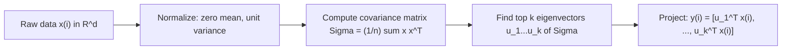

# CS229 — Principal Components Analysis (PCA)

## 1. Motivation

### 1.1 What is it?
**PCA** identifies the subspace in which data **approximately lies**, letting us represent high-dimensional data with far fewer dimensions while retaining most of its meaningful structure. It's computationally efficient — it reduces to an **eigenvector calculation**.

### 1.2 Why Redundancy Exists in Real Data

**Example 1 — exact redundancy:** a dataset of car attributes $x^{(i)}\in\mathbb{R}^d$ might contain both "max speed in mph" and "max speed in kph" — two coordinates that are almost linearly dependent (differing only by rounding). The data effectively lives on a $(d-1)$-dimensional subspace, even though it's stored in $d$ dimensions.

**Example 2 — approximate/soft redundancy:** a survey of RC helicopter pilots records $x_1$ = piloting skill and $x_2$ = enjoyment of flying. Since only people who genuinely enjoy flying tend to practice enough to become skilled, $x_1$ and $x_2$ are strongly correlated — the data lies close to a diagonal axis $u_1$ (an underlying "piloting karma"), with only small noise off that axis.

> 💡 **Intuition:** PCA automatically discovers this kind of hidden axis ($u_1$ in the example) directly from data, without needing to be told in advance that skill and enjoyment are related.

---

## 2. Preprocessing: Normalization

Before running PCA, features are typically normalized to **mean 0, variance 1**:
$$
x_j^{(i)} \leftarrow \frac{x_j^{(i)} - \mu_j}{\sigma_j}, \qquad \mu_j = \frac1n\sum_{i=1}^n x_j^{(i)}, \qquad \sigma_j^2 = \frac1n\sum_{i=1}^n (x_j^{(i)}-\mu_j)^2
$$

- **Subtracting $\mu_j$** (mean-centering): zeros out the mean. Can be **skipped** if data is already known to have zero mean (e.g., acoustic/time-series signals).
- **Dividing by $\sigma_j$**: rescales every feature to unit variance, so no single feature dominates purely due to raw numeric scale. Example: car max speed (tens/hundreds) vs. number of seats (2–4) — without rescaling, speed would dominate any variance-based calculation just because of its larger numbers. Can be **skipped** if all features are already on the same natural scale (e.g., grayscale pixel intensities all in $\{0,\dots,255\}$).

> ⚠️ **Important:** normalization isn't optional busywork — since PCA's entire method is based on **variance**, failing to rescale features with different natural units/ranges will bias PCA toward whichever feature happens to have larger raw numbers, regardless of its actual importance.

---

## 3. Finding the Principal Direction (k = 1 Case)

### 3.1 The Goal, Visually

We want a unit vector $u$ such that **projecting the data onto $u$ preserves as much variance as possible**.

> 💡 **Intuition:** the data starts with a certain amount of variance/information. If we're going to approximate it as lying along a single direction $u$, we want to pick the $u$ that keeps as much of that original variance as we can — a bad choice of $u$ would collapse most points close to the origin after projection, throwing away the information that distinguished them.

Given a unit vector $u$ and a point $x$, the (signed) length of $x$'s projection onto $u$ is $x^Tu$. So maximizing the variance of the projected data means choosing unit-length $u$ to maximize:

$$
\frac1n\sum_{i=1}^n \left(x^{(i)T}u\right)^2 = \frac1n\sum_{i=1}^n u^Tx^{(i)}x^{(i)T}u = u^T\left(\frac1n\sum_{i=1}^n x^{(i)}x^{(i)T}\right)u
$$

### 3.2 The Solution: Principal Eigenvector of the Covariance Matrix

Define the empirical covariance matrix (assuming zero mean, after preprocessing):
$$
\Sigma = \frac1n\sum_{i=1}^n x^{(i)}x^{(i)T}
$$

We're maximizing $u^T\Sigma u$ subject to $\|u\|^2=1$. Using Lagrange multipliers on this constrained optimization gives:
$$
\Sigma u = \lambda u
$$
— i.e., $u$ must be an **eigenvector** of $\Sigma$, with eigenvalue $\lambda$.

> 💡 **Intuition:** since $u^T\Sigma u = u^T\lambda u = \lambda\|u\|^2=\lambda$ (using $\|u\|=1$), the quantity we're maximizing is *exactly* the eigenvalue $\lambda$. So to maximize variance, we pick the eigenvector with the **largest** eigenvalue — the **principal eigenvector** of $\Sigma$.

---

## 4. Generalizing to k Dimensions

To project data into a $k$-dimensional subspace ($k<d$): choose $u_1,\dots,u_k$ to be the **top $k$ eigenvectors** of $\Sigma$ (largest eigenvalues first).

- Because $\Sigma$ is symmetric, the $u_i$'s are (or can always be chosen to be) **orthogonal** — they form a new orthogonal basis for the data.
- $u_1,\dots,u_k$ are called the **first $k$ principal components**.

**Representing a point in the new basis:**
$$
y^{(i)} = \begin{bmatrix} u_1^Tx^{(i)} \\ u_2^Tx^{(i)} \\ \vdots \\ u_k^Tx^{(i)} \end{bmatrix} \in \mathbb{R}^k
$$
- $x^{(i)}\in\mathbb{R}^d$ → the original high-dimensional point.
- $y^{(i)}\in\mathbb{R}^k$ → its lower-dimensional representation — hence PCA is also called a **dimensionality reduction** algorithm.

> ⚠️ **Important:** among **all** possible orthogonal $k$-dimensional bases, this particular choice of $u_1,\dots,u_k$ is the one that **maximizes** $\sum_i\|y^{(i)}\|_2^2$ — i.e., it preserves as much variability from the original data as any orthogonal basis of that dimension could. (Proven above for $k=1$; extends via standard eigenvector properties for general $k$.)

**Alternative derivation (not detailed here, see homework):** PCA can equivalently be derived by choosing the basis that **minimizes** the approximation/reconstruction error from projecting data onto the $k$-dimensional subspace — a different objective that yields the exact same principal components.

| Framing | Objective | Result |
|---|---|---|
| Variance-maximization (this note) | Maximize $\sum_i\|y^{(i)}\|_2^2$ | Top-$k$ eigenvectors of $\Sigma$ |
| Reconstruction-error minimization | Minimize projection/reconstruction error | Same top-$k$ eigenvectors of $\Sigma$ |



---

## 5. Applications of PCA

| Application | What PCA Does |
|---|---|
| **Compression** | Represent $x^{(i)}$ with a much smaller $y^{(i)}$, saving space/computation. |
| **Visualization** | Reduce data to $k=2$ or $3$ dimensions and plot it, revealing clusters or similarity structure (e.g., which car types are similar). |
| **Preprocessing for supervised learning** | Reduce input dimensionality before training a classifier/regressor — cuts computation, and can reduce overfitting (e.g., a linear classifier on lower-dimensional inputs has smaller VC dimension). |
| **Noise reduction** | Recover an underlying "signal" direction from noisy, correlated measurements (e.g., the RC-pilot "karma" example) by keeping only the top principal components and discarding the rest as noise. |

**Case study — Eigenfaces:** each face image is a $100\times100$ pixel grid, i.e., a $10{,}000$-dimensional vector $x^{(i)}$. PCA reduces each image to a much lower-dimensional $y^{(i)}$, ideally retaining the systematic variation that distinguishes different people's faces while discarding noise (lighting variation, minor imaging differences). Face similarity is then measured as $\|y^{(i)}-y^{(j)}\|_2$ in the reduced space — this produced a surprisingly effective face-matching and retrieval method.

---

# Key Takeaways

**Big picture flow:**
```text
Raw high-dimensional data (often with redundant/correlated features)
        v
Normalize: zero mean, unit variance (so no feature dominates by raw scale)
        v
Maximize variance of projected data <=> find top eigenvectors of covariance matrix Sigma
        v
Represent each point by its projections onto the top k eigenvectors: y(i) in R^k
        v
Applications: compression, visualization, preprocessing for supervised learning, noise reduction
```

- **Goal:** find a lower-dimensional subspace that the data approximately lies in, exploiting redundancy/correlation between original features.
- **Preprocessing matters:** mean-centering and unit-variance scaling are typically both needed (unless the data already satisfies one of these properties naturally) — since PCA optimizes variance directly, unnormalized scale differences would bias the result.
- **Core result:** the direction $u$ that maximizes the variance of the projected data $\frac1n\sum_i(x^{(i)T}u)^2$, subject to $\|u\|=1$, is the **principal eigenvector** of the empirical covariance matrix $\Sigma=\frac1n\sum_i x^{(i)}x^{(i)T}$ — this falls directly out of solving $\max u^T\Sigma u$ s.t. $\|u\|^2=1$ via Lagrange multipliers, giving $\Sigma u=\lambda u$.
- **General $k$:** the top $k$ eigenvectors of $\Sigma$ (by eigenvalue) form an orthogonal basis $u_1,\dots,u_k$, called the first $k$ **principal components**; projecting onto them gives the reduced representation $y^{(i)}=[u_1^Tx^{(i)},\dots,u_k^Tx^{(i)}]\in\mathbb{R}^k$.
- **Optimality:** this choice of basis maximizes retained variance ($\sum_i\|y^{(i)}\|_2^2$) among all orthogonal $k$-dimensional bases — equivalently, it minimizes reconstruction error, a different objective that yields the identical solution.
- **Uses:** compression, 2-D/3-D visualization, dimensionality reduction before supervised learning (computational and overfitting benefits via reduced VC dimension), and noise reduction (isolating a true underlying signal from noisy, correlated raw measurements) — as demonstrated by the eigenfaces application.
