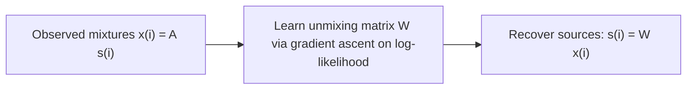

# CS229 — Independent Components Analysis (ICA)

## 1. The Cocktail Party Problem

### 1.1 What is it?
**ICA** finds a new basis to represent data, similar in spirit to PCA — but with a very different goal: instead of finding directions of maximum variance, ICA tries to **un-mix** signals that have been linearly combined, recovering their original independent sources.

> 💡 **Intuition:** at a cocktail party, $d$ people speak simultaneously. $d$ microphones, placed at different distances from each speaker, each record a *different mixture* of all the voices. ICA asks: given only the microphone recordings, can we recover each individual speaker's original voice?

### 1.2 The Model

We assume data $s\in\mathbb{R}^d$ is generated by $d$ **independent sources**, and we observe:
$$
x = As
$$
- $s^{(i)}$ → the (unobserved) source vector at observation $i$; $s_j^{(i)}$ = what speaker $j$ was saying at time $i$.
- $A$ → the unknown, square **mixing matrix**.
- $x^{(i)}$ → the observed vector; $x_j^{(i)}$ = what microphone $j$ recorded at time $i$.

**Goal:** recover the sources $s^{(i)}$ from the observations $x^{(i)}=As^{(i)}$.

Define the **unmixing matrix** $W=A^{-1}$. If we can find $W$, we recover sources via:
$$
s^{(i)} = Wx^{(i)}
$$
Writing $W$ in terms of its rows $w_j^T$:
$$
W = \begin{bmatrix} -\,w_1^T\,- \\ \vdots \\ -\,w_d^T\,- \end{bmatrix}, \qquad s_j^{(i)} = w_j^Tx^{(i)}
$$

---

## 2. ICA Ambiguities

Even with unlimited data, some aspects of $A$ (equivalently $W$) can **never** be recovered from the $x^{(i)}$'s alone.

### 2.1 Permutation Ambiguity

For any permutation matrix $P$ (each row/column has exactly one 1), $x^{(i)}=As^{(i)}$ is indistinguishable from data generated using $PA$ instead — there is no way to tell $W$ apart from $PW$.

> ⚠️ **Important:** this means the **order** in which sources are recovered is arbitrary. This doesn't matter in practice — we still recover each speaker's voice, just without knowing in advance which output channel corresponds to which speaker.

### 2.2 Scaling Ambiguity

If a single column of $A$ is scaled by $\alpha$ and the corresponding source is scaled by $1/\alpha$, the observed $x^{(i)}$ is unchanged. So the **scale** (including sign) of each recovered source is also unrecoverable.

> 💡 **Intuition:** for the cocktail party problem, this ambiguity is harmless — scaling a speaker's voice signal $s_j^{(i)}$ by a positive $\alpha$ only changes its **volume**, and a sign flip ($s_j^{(i)}$ vs. $-s_j^{(i)}$) sounds identical played through a speaker.

### 2.3 The Gaussian Problem — Is There a Third Ambiguity?

These two ambiguities (permutation, scaling) are the **only** ones — *provided the sources are non-Gaussian*. If sources are Gaussian, there's an additional, fatal ambiguity.

**Why Gaussian sources break ICA:** let $s\sim N(0,I)$. Then $x=As \sim N(0,AA^T)$, since:
$$
\mathbb{E}[x] = A\mathbb{E}[s] = 0, \qquad \text{Cov}[x] = \mathbb{E}[Ass^TA^T] = A\,\text{Cov}[s]\,A^T = AA^T
$$

Now let $R$ be any **orthogonal** (rotation/reflection) matrix, so $RR^T=R^TR=I$, and define $A'=AR$. Data mixed with $A'$ instead of $A$ gives $x'=A's \sim N(0,A'A'^T)$, and:
$$
A'A'^T = ARR^TA^T = AA^T
$$
— **exactly the same covariance** as before! So $x$ and $x'$ have the **identical distribution** $N(0,AA^T)$, meaning there is **no way**, from the data alone, to tell whether the true mixing matrix was $A$ or $A'=AR$ for *any* rotation $R$.

> ⚠️ **Important:** this is a consequence of the standard multivariate Gaussian's **rotational symmetry** (its density contours are circles/spheres centered at the origin, unchanged by rotation). Because of this, **ICA fundamentally cannot work on Gaussian-distributed sources** — the mixing matrix has an unrecoverable rotational degree of freedom. Fortunately, as long as the true sources are **non-Gaussian**, permutation and scaling remain the *only* ambiguities, and with enough data the sources can be recovered.

---

## 3. Densities Under Linear Transformations

Before deriving the ICA algorithm, we need to know how a density transforms under a linear map — this is **not** as simple as just substituting variables.

### 3.1 The 1-D Case

Let $s$ have density $p_s(s)$, and $x=As$ (scalar $A$). Let $W=A^{-1}$.

> ⚠️ **Important — common mistake:** it is tempting to guess $p_x(x)=p_s(Wx)$. This is **wrong**.

**Counterexample:** let $s\sim\text{Uniform}[0,1]$, so $p_s(s)=\mathbb{1}\{0\leq s\leq1\}$. Let $A=2$, so $x=2s\sim\text{Uniform}[0,2]$, giving $p_x(x)=0.5\cdot\mathbb{1}\{0\leq x\leq2\}$. But $p_s(Wx)=p_s(0.5x)=\mathbb{1}\{0\leq x\leq2\}$ — missing the factor of $0.5$.

**Correct formula:**
$$
p_x(x) = p_s(Wx)\cdot|W|
$$

### 3.2 The General (Vector) Case

For $x=As$ with $A$ square invertible, $W=A^{-1}$:
$$
p_x(x) = p_s(Wx)\cdot|W|
$$

> 💡 **Intuition (geometric derivation):** a linear map $A$ sends the unit hypercube $C_1=[0,1]^d$ to a region $C_2=\{As:s\in C_1\}$ with volume $|A|$ (a standard linear-algebra fact — one way determinants are defined). If $s$ is uniform on $C_1$ ($p_s(s)=\mathbb{1}\{s\in C_1\}$), then $x=As$ is uniform on $C_2$, so $p_x(x)=\mathbb{1}\{x\in C_2\}/\text{vol}(C_2)$. Since $\text{vol}(C_2)=|A|$ and $1/|A|=|A^{-1}|=|W|$, and $x\in C_2 \iff Wx\in C_1$, this gives exactly $p_x(x)=\mathbb{1}\{Wx\in C_1\}|W|=p_s(Wx)|W|$ — matching the general formula (and generalizing beyond the uniform case).

---

## 4. The ICA Algorithm (Bell & Sejnowski)

### 4.1 Modeling the Source Density

Assume sources are **independent**, so their joint density factors:
$$
p(s) = \prod_{j=1}^d p_s(s_j)
$$
- Modeling the joint as a **product of marginals** is exactly what encodes the independence assumption.

Using the linear-transformation density formula from Section 3 (with $x=As=W^{-1}s$):
$$
p(x) = \prod_{j=1}^d p_s(w_j^Tx)\cdot|W|
$$

**Choosing $p_s$:** we need some cumulative distribution function (cdf) $F$ (monotonic, $0\to1$) so that $p_s=F'$.

> ⚠️ **Important:** we **cannot** choose the Gaussian cdf — Section 2.3 showed ICA fundamentally fails on Gaussian sources. Instead, a common "default" choice (absent prior knowledge about the true source density) is the **sigmoid**: $F(s)=g(s)=\frac{1}{1+e^{-s}}$, giving $p_s(s)=g'(s)$.

> ⚠️ **Important:** the sigmoid choice implicitly assumes $\mathbb{E}[s]=0$ (since $g'$ is symmetric), which in turn requires $\mathbb{E}[x]=\mathbb{E}[As]=0$ — so the input data $x^{(i)}$ should be zero-mean (either naturally, as with acoustic signals, or after preprocessing).

### 4.2 Maximum Likelihood Estimation

$W$ is the only parameter. The log-likelihood over a training set $\{x^{(i)}\}_{i=1}^n$:
$$
\ell(W) = \sum_{i=1}^n\left(\sum_{j=1}^d \log g'(w_j^Tx^{(i)}) + \log|W|\right)
$$

> ⚠️ **Important:** this assumes the $x^{(i)}$'s are independent across $i$ (different time points) — not to be confused with the independence *between coordinates* of a single $x^{(i)}$. This assumption is technically wrong for time-series data like speech (successive samples are correlated), but empirically doesn't hurt performance given enough data. For correlated training examples, shuffling the order before running stochastic gradient ascent can help convergence speed.

### 4.3 Stochastic Gradient Ascent Update

Taking derivatives of $\ell(W)$ with respect to $W$ (using $\nabla_W|W| = |W|(W^{-1})^T$ from earlier notes), the **stochastic gradient ascent** update for a single example $x^{(i)}$ is:
$$
W := W + \alpha\left(\begin{bmatrix}1-2g(w_1^Tx^{(i)}) \\ 1-2g(w_2^Tx^{(i)}) \\ \vdots \\ 1-2g(w_d^Tx^{(i)})\end{bmatrix}x^{(i)T} + (W^T)^{-1}\right)
$$
- $\alpha$ → learning rate.
- The $\left(1-2g(w_j^Tx^{(i)})\right)$ terms → come from differentiating $\log g'(w_j^Tx^{(i)})$ with respect to $w_j$.
- $(W^T)^{-1}$ → comes from differentiating the $\log|W|$ term.

### 4.4 Algorithm Summary

1. (Optionally) center the data so $x^{(i)}$ has zero mean.
2. Initialize $W$.
3. Repeat until convergence: for each training example $x^{(i)}$ (optionally in random shuffled order if examples are correlated), apply the stochastic gradient ascent update above.
4. Once converged, recover the sources: $s^{(i)} = Wx^{(i)}$.



---

# Key Takeaways

**Big picture flow:**
```text
Cocktail party problem: x = As, recover s given only x
        v
Ambiguities: permutation and scaling (harmless); rotation ambiguity if sources are Gaussian (fatal)
        v
Density transformation rule: p_x(x) = p_s(Wx) * |W|,  W = A^-1
        v
Model joint source density as product of marginals (encodes independence)
        v
Choose non-Gaussian source density (sigmoid derivative as default)
        v
Maximum likelihood over W -> stochastic gradient ascent update rule
        v
Recover sources: s^(i) = W x^(i)
```

- **ICA vs. PCA**: both find a new basis, but PCA maximizes variance/reduces dimensionality, while ICA **un-mixes** linearly combined independent signals — a fundamentally different goal.
- **Model**: $x=As$, with $A$ the unknown mixing matrix and $W=A^{-1}$ the unmixing matrix we solve for; sources recovered via $s^{(i)}=Wx^{(i)}$.
- **Unavoidable ambiguities**: permutation of recovered sources and their scaling/sign are both unrecoverable from data alone — but harmless for applications like speech separation.
- **Gaussian sources break ICA**: because the standard multivariate Gaussian is rotationally symmetric, any rotation $R$ applied to the mixing matrix ($A\to AR$) produces observations with the exact same distribution — making the mixing matrix's rotational component fundamentally unidentifiable. ICA requires **non-Gaussian** sources.
- **Density transformation under linear maps**: $p_x(x)=p_s(Wx)\cdot|W|$ — naively substituting $s=Wx$ into $p_s$ without the $|W|$ Jacobian-determinant factor is a common and incorrect shortcut.
- **Algorithm**: model $p(x)=\prod_j p_s(w_j^Tx)\cdot|W|$ with independent-source assumption baked in via the product-of-marginals structure; use a sigmoid-derivative as a generic non-Gaussian source density; maximize the resulting log-likelihood over $W$ via stochastic gradient ascent, using the update rule involving $(1-2g(w_j^Tx^{(i)}))x^{(i)T}$ and $(W^T)^{-1}$.
- **Practical assumption**: data should be zero-mean (matching the sigmoid-derivative source density's implicit assumption that $\mathbb{E}[s]=0$).
